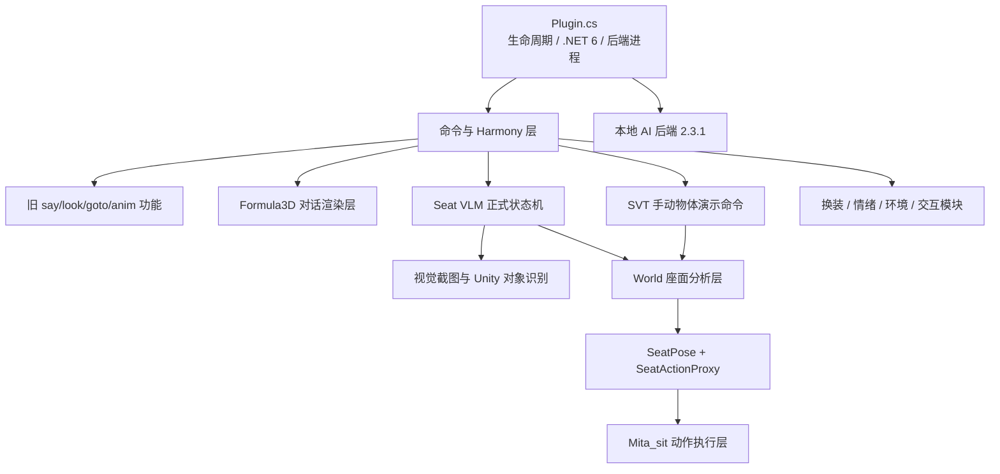
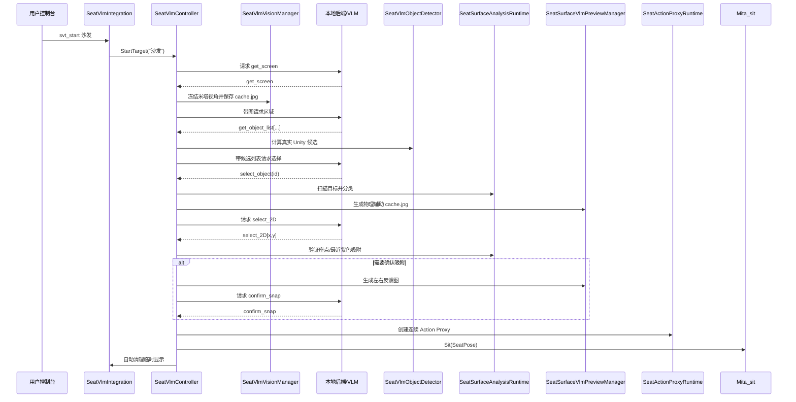

# MakemitAGA 项目架构与维护手册

> 文档对应版本：**Miside AI Modular 0.2.3 / .NET 6 / Formula3D v0.3.10 / Backend 2.3.1 / Seat VLM 高度感知边缘版**  
> 文档修订日期：**2026-07-01**  
> 目标环境：**MiSideFull / Unity 2021.3.35f1 / Windows x64 / IL2CPP / BepInEx 6 / .NET 6.0**  
> 文档用途：在项目继续扩大之前，为后续开发者提供一份“先读这个就能继续工作”的源码地图、迁移记录与回归基线。

---

## 0. 这份文档应该怎样使用

这份文档不是 API 自动生成结果，而是当前项目的**人工维护架构说明**。

新开发者建议按以下顺序阅读：

1. 先读“整体架构”和“不可破坏的设计约束”；
2. 再根据要修改的功能，查“修改某功能时应该去哪里”；
3. 最后阅读对应文件的“特别注意”；
4. 修改后按照“回归测试清单”逐项验证；
5. 架构发生变化时，同步更新本文件，而不是只在聊天记录里留下说明。

文档中提到的“正式 Seat VLM”指当前主流程：

```text
svt_start <目标>
→ 米塔视角截图
→ VLM 圈选目标区域
→ Unity 真实对象候选
→ VLM 选择真实对象
→ 深度扫描与座面分类
→ VLM 选择紫色动作有效点
→ 必要时吸附确认
→ 生成 SeatPose
→ 创建连续 SeatActionProxy
→ Mita_sit 执行坐下
→ 自动清理临时可视化
```

本次修订加入了**独立于正式 Seat VLM 的手动物体演示流程**：

```text
debug_svt_test(真实对象名)
→ 按真实名称选择最近的活动对象
→ 执行与正式流程一致的顶视深度扫描和座面分类
→ 显示青/绿/红/橙/紫分析网格
→ 不连接 VLM，不调用 Mita_sit，不覆盖正式分析结果

debug_svt_mesh(真实对象名)
→ 只显示来自 SeatSurface_ProxyMeshCollider 几何的青色完整高度图

svt_test_clear
→ 只清理手动测试展示
→ 不影响 svt_start、正式分析 Collider 或 SeatActionProxy
```

该功能由新增的 `World/SeatSurfaceManualDebugTest.cs` 承担，并使用独立对象列表、Renderer 列表和扫描序号管理生命周期。

---

## 0.1 当前版本坐标

项目现在同时存在三套版本号，必须区分：

| 版本 | 当前值 | 含义 |
|---|---:|---|
| BepInEx 插件版本 | `0.2.3` | `Plugin.cs` 中的正式插件版本 |
| Formula3D 迭代标签 | `v0.3.10` | 本轮公式、字体和布局调整的开发版本 |
| Python 后端版本 | `2.3.1` | `OnlineAIApiServer.exe` / `online_api_server.py` 版本 |

Formula3D 的 `v0.3.10` 不是 BepInEx 插件版本。正式发布时若要统一版本号，应单独决定发布策略，不要把三个版本混写。

## 0.2 2026-07-01 当前稳定状态

根据本轮实际测试，以下主线已跑通：

```text
.NET Framework 4.7.2
→ SDK 风格 net6.0
→ 后端 UTF-8 与进程生命周期修复
→ Formula3D 主项目整合
→ 游戏运行时艺术字体恢复
→ 普通文字与公式同尺寸白边
→ 运行时字体宽度与公式高度适配
→ Bed 高度感知边缘恢复紫色区域
→ 紫色动作带向床沿侧调整
```

当前已经验证：

- 项目可在 `net6.0 / x64` 下正常编译并被 BepInEx 加载；
- `say`、Formula3D 测试命令和混合文字/公式显示正常；
- 普通文字使用 `GlobalGame.fontUse` 对应的游戏艺术字体；
- 公式使用 CSharpMath 数学字体，普通文字与公式保持独立字体路径；
- 普通文字和公式均使用同尺寸的白色 `Outline`，不再依赖偏移白底；
- 公式支持 1～4 个游戏字符宽度，并按运行时艺术字体实际宽度排版；
- Bed 与 Sofa 都能生成紫色动作有效区域；
- Bed 的床垫边缘通过高度断层识别，不再误用床架最外轮廓；
- 后端支持 UTF-8、主动 `/shutdown`、父进程 watchdog 和孤儿进程清理；
- 游戏退出后后端应随 MiSide 一起结束，不再长期占用 Steam 运行状态。

仍需长期观察：

- 不同章节、不同语言和不同字体资源下的 Formula3D 字宽；
- 极长公式的四字宽缩放可读性；
- 更多床、沙发、椅子结构下的紫色动作带；
- 连续场景切换、反复后端重启和长时间运行的资源稳定性。

---

# 1. 项目的一分钟总览

MakemitAGA 当前由七个主要层组成：



七层职责：

| 层 | 主要目录/文件 | 职责 |
|---|---|---|
| 插件生命周期层 | `Plugin.cs` | 初始化、场景切换、Harmony、后端进程、主线程 Tick、退出清理 |
| 通信层 | `Connection/`、后端源码 | HTTP、健康检查、分块读取、模型请求、后端生命周期 |
| 命令与游戏钩子层 | `DialoguePatches.cs`、`VisionPatches.cs`、`SeatVlmIntegration.cs` | 控制台命令分发、Harmony 拦截、原生字体观察 |
| Formula3D 对话层 | `Dialogue/Formula*.cs`、`GameUIManager.cs` | 文本/LaTeX 解析、Skia 渲染、原生 Symbol、字体、白边、掉落 |
| 感知与选择层 | `SeatVlmVisionManager`、`SeatVlmObjectDetector`、`SeatVlmController` | 截图、候选对象、工具协议、状态机 |
| 世界几何层 | `World/SeatSurface*.cs`、`SeatActionProxy.cs` | 深度扫描、座面分析、高度感知边缘、物理代理、手动演示 |
| 角色动作层 | `Mita_sit.cs` | 寻路、控制权、动画、IK、坐姿锁、起身恢复 |

当前两条主要用户功能链：

```text
AI 对话：
say / math3d_show
→ 文本与 LaTeX Token
→ 普通文字使用游戏艺术字体
→ 公式渲染为透明纹理
→ 原生 Dialogue_Symbol 入场与掉落

Seat VLM：
svt_start <目标>
→ 截图与 VLM 工具链
→ Unity 对象
→ 深度高度图
→ 承重/高度/边缘/动作有效区
→ SeatPose
→ SeatActionProxy
→ Mita_sit
```

---

# 2. 当前最重要的设计边界

这些约束是项目稳定性的基础。修改代码时，优先保证它们不被破坏。

## 2.1 环境理解面与动作执行面必须分离

项目存在两种表面：

### A. `SeatSurfaceAnalysisRuntime` 生成的稀疏分析网格

用途：

- 表示完整目标家具；
- 保留靠背、扶手、坐垫等多个高度岛；
- 判断承重、坡度、边缘、站立空间、腿部空间；
- 为 `select_2D` 和最近有效点吸附提供物理查询。

它是**环境理解层**，不是最终动画支撑面。

### B. `SeatActionProxyRuntime` 生成的小型连续平面

用途：

- 围绕最终确定的座点创建稳定、连续、法线一致的薄面；
- 给 `Mita_sit` 提供稳定动作基准；
- 避免完整高度图的三角形接缝、噪声和局部尖角干扰动画。

它是**动作执行层**。

禁止重新把整个家具简化成一个大平面，也不建议让米塔直接长期依赖完整分析网格执行坐姿。

---

## 2.2 调试显示与物理 Collider 生命周期必须分离

`debug_svt` 只控制 Renderer 是否显示。

```text
debug_svt off
≠
删除分析 MeshCollider
≠
删除 Action Proxy Collider
```

`svt_clear` 与自动完成清理会：

- 清理黄色射线、候选框、截图相机和临时标记；
- 隐藏彩色分类 Renderer；
- **保留分析 MeshCollider**；
- **保留当前动作代理 Collider**。

场景切换才执行完整销毁。

---

## 2.3 Unity API 必须在主线程使用

HTTP 请求可以在后台任务中运行，但以下操作必须回到 Unity 主线程：

- `GameObject.Find`
- `Instantiate` / `Destroy`
- `GetComponent`
- `Camera.Render`
- `Renderer.enabled`
- `Mesh` / `MeshCollider`
- `NavMesh`
- Animator 与 FinalIK

`Plugin.MainThreadRunner.Update()` 是主线程状态机驱动点。不要从 `Task` 回调直接操作 Unity 对象。

---

## 2.4 场景引用不能跨场景复用

MiSide 切换菜单、Loading、章节场景时，旧 Unity 对象会失效。

场景切换必须清理：

- 摄像机和 SnapshotCamera；
- Renderer 缓存；
- House/Room/Target 缓存；
- Seat VLM 状态；
- 分析网格和 Action Proxy；
- `Mita_sit` 的动作控制权、IK 引用和坐姿锁；
- EnvironmentManager 的场景引用。

所有新增静态模块都应该提供：

```csharp
ClearSceneReferences()
ResetForSceneChange(...)
ClearAll()
```

中的至少一种。

---

## 2.5 VLM 截图材质替换必须是原子的

辅助图需要临时把场景替换为白色背景、灰色目标和彩色分类面。

正确流程必须是：

```text
WaitForEndOfFrame
→ 临时修改 Renderer/Material
→ 私有相机 Camera.Render
→ ReadPixels
→ 同步恢复所有现场状态
→ 恢复后才 yield
```

中间不能 `yield return null`，否则主游戏相机会在下一帧看到灰白材质，造成“世界闪灰”。

---

## 2.6 AssetBundle 必须继续使用 iCall 路线

MiSide IL2CPP 环境中，普通 `AssetBundle.LoadFromFile` 曾出现不稳定和重复加载问题。

深度资源必须继续通过：

```text
IL2CPP.ResolveICall
AssetBundle::LoadFromFile_Internal
AssetBundle::LoadAsset_Internal
```

并缓存 Bundle 指针和资源。

同一游戏进程中不要让多个 DLL 重复加载 `mita_actions`。

---

## 2.7 IL2CPP 注入类不要暴露不支持的方法签名

`Mita_sit` 是自定义 IL2CPP `MonoBehaviour`。

以下纯托管签名必须使用 `[HideFromIl2Cpp]`：

- `IEnumerator`
- `SeatPose` 等普通托管对象参数
- `System.Object`
- 反射辅助方法

否则 Il2CppInterop 会输出 unsupported parameter/return type 警告，甚至在某些版本中导致注入失败。

---

## 2.8 Seat VLM 的磁盘输出规则

默认情况下，运行时允许写入：

```text
BepInEx/plugins/cache.jpg
BepInEx/plugins/config.json
```

后端调试文件默认关闭：

```json
"WRITE_BACKEND_DEBUG_FILE": false
```

开启时只允许生成：

```text
BepInEx/plugins/backend_debug.txt
```

不要重新引入：

```text
backend_boot.log
backend_last_prompt.txt
backend_last_reply.txt
seat_vlm_result.json
seat_surface_preview_meta.json
```

模型交互过程应继续实时输出到 BepInEx 控制台。

---

## 2.9 正式 SVT 与手动测试展示必须拥有独立生命周期

手动演示命令用于在不经过 VLM 的情况下，按 Unity Explorer 中看到的真实对象名重建座面分析效果。它不能复用正式流程的对象所有权。

正式流程使用：

```text
_created
_debugRenderers
_scanSerial
_scanInProgress
```

手动测试使用：

```text
_manualDebugCreated
_manualDebugRenderers
_manualDebugScanSerial
_manualDebugScanInProgress
```

必须保持以下语义：

| 操作 | 正式 Seat VLM | 手动测试展示 |
|---|---|---|
| `svt_clear` | 清理正式临时展示并保留正式 Collider | 不删除、不隐藏 |
| `debug_svt on/off` | 控制正式调试 Renderer | 不控制 |
| `svt_test_clear` | 不影响 | 取消扫描并销毁全部手动测试对象 |
| 新的手动测试命令 | 不覆盖正式最后分析结果 | 先替换旧手动测试结果 |
| 场景切换/插件卸载 | 完整清理 | 完整清理 |

额外约束：

1. 正式扫描进行中时，手动测试必须拒绝启动，避免两个扫描相机同时修改目标 Layer；
2. 手动测试构建的 `MeshCollider` 必须禁用，只把网格作为展示几何，不能产生重复物理碰撞；
3. 同名对象按完整名称、不区分大小写匹配，并选择离主游戏摄像机最近且具有可用 Bounds 的活动对象；
4. 手动测试不连接后端、不启动 VLM、不调用 `Mita_sit`；
5. C# 协程不能在带 `catch` 的 `try` 中使用 `yield`。手动测试采用 `ManualDebugScanRoutineCore()` 的 `try/finally` 执行扫描，再由外层 `MoveNext()` 包装器捕获异常，避免 `CS1626`。

---

## 2.10 `.NET 6`、SDK 风格项目与依赖边界

当前 `MakemitAGA.csproj` 已改为 SDK 风格：

```xml
<TargetFramework>net6.0</TargetFramework>
<LangVersion>10.0</LangVersion>
<PlatformTarget>x64</PlatformTarget>
```

必须保持：

- Unity、BepInEx、Il2CppInterop、Harmony、Assembly-CSharp 等宿主引用为 `<Private>false</Private>`；
- 不把游戏自带 DLL 嵌入 `MakemitAGA.dll`；
- NuGet 托管依赖由 Costura 处理；
- 原生 `libSkiaSharp.dll` 不交给 Costura，而是作为资源嵌入并由 `NativeSkiaBootstrap` 提取；
- 不重新加入旧 `packages.config` 中为 `net472` 准备的大量 `System.*` 兼容包。

当前 Formula3D NuGet：

```text
CSharpMath.SkiaSharp 0.5.1
SkiaSharp 2.88.9
SkiaSharp.NativeAssets.Win32 2.88.9
Fody 6.8.2
Costura.Fody 6.0.0
```

## 2.11 Formula3D 字体、白边和每帧同步不能拆散

普通文字与公式使用不同字体路径：

```text
普通文字
→ GlobalGame.fontUse
→ UnityEngine.UI.Text

数学公式
→ CSharpMath + SkiaSharp
→ PNG / Texture2D / RawImage
```

重要约束：

1. 私有 `Dialogue_3DText` 模板不会执行原生 `Start()`，不能只相信模板内的 `font`；
2. 普通文字必须优先读取 `GlobalGame.fontUse`；
3. 原生 `Dialogue_3DText.Start` Postfix 负责缓存已经初始化完成的真实字体；
4. 普通文字和公式的白边都使用同尺寸 `UnityEngine.UI.Outline`；
5. 公式 RawImage 的 Alpha 仍由隐藏 Text 的原生动画驱动；
6. `MainThreadRunner.Update()` 必须每帧调用 `GameUIManager.Tick()`；
7. 若删除该 Tick，公式会占位但保持透明；
8. 场景切换必须销毁私有模板、当前句、运行时 Texture2D 和字体缓存。

## 2.12 后端必须拥有明确的退出所有权

`OnlineAIApiServer.exe` 不能只依赖一个 `Process.Kill()`。

当前停止顺序：

```text
POST /shutdown（随机 token）
→ 等待后端主动退出
→ Kill(entireProcessTree: true) 兜底
→ WaitForExit
→ Dispose
```

同时存在三层保险：

```text
MainThreadRunner.OnApplicationQuit
MainThreadRunner.OnDestroy
Python 父进程 watchdog
```

首次启动会清理旧版遗留的同名孤儿进程。不要删除父 PID、shutdown token 或 watchdog，否则 Steam 可能再次长期显示游戏仍在运行。

## 2.13 “当前座面边缘”必须识别高度断层

完整家具扫描会同时保留：

```text
床垫
床架
靠背
扶手
坐垫
其他较低结构
```

因此动作边缘不能只判断“下一格有没有任何表面”。

当前边缘语义：

```text
走出网格
或下一格无表面
或下一格相对当前座面向下落差至少 0.16m
＝ 当前座面平台边缘
```

当前关键参数：

```text
ActionBoundaryMinDownwardDrop = 0.16m
ActionMinEdgeInset            = 0.02m
ActionMaxEdgeInset            = 0.40m
SeatMaxPatchHeightRange       = 0.125m
SeatMinNormalY                = 0.58
```

该方案解决 Bed 的床垫边缘被床架“连接”后紫色区域归零的问题，同时保持 Sofa 的多高度层扫描。

不要只通过无限放宽 `ActionMaxEdgeInset` 解决问题；真正的边缘必须先找对，后续地板、NavMesh、身体胶囊、接近走廊和腿部空间检查才有意义。

---

# 3. 启动与生命周期

## 3.1 插件启动顺序

`Plugin.Load()` 当前顺序：

```text
1. 初始化全局 Logger / Instance 与 UTF-8 控制台
2. 读取 plugins/config.json，并初始化换装状态
3. 注册 SceneManager.sceneLoaded
4. 挂载 MainThreadRunner
5. GameUIManager.Initialize(Logger)
6. 注册 Mita_sit IL2CPP 类型
7. 清理历史孤儿后端并启动 OnlineAIApiServer.exe
8. 初始化 Seat VLM
9. 应用视觉、对话、互动、坐姿控制权和换装 Harmony 补丁
```

这个顺序不要随意调整：

- 配置必须在启动后端前完成；
- `Runner` 必须在任何协程和主线程消费前存在；
- Formula3D 初始化只保存日志与字体入口，不应在菜单阶段强行寻找场景对象；
- `Mita_sit` 类型必须注册后才能按需 AddComponent；
- Seat VLM 必须在控制台命令被调用前初始化；
- 后端启动前的孤儿进程清理只应在本次游戏首次启动后端时执行一次。

## 3.2 每帧主线程

`MainThreadRunner.Update()` 当前负责：

```text
Plugin.Instance.PollBackendProcess()
SeatVlmController.Tick()
GameUIManager.Tick()
```

其中：

- `SeatVlmController.Tick()` 消费后台模型结果并执行 Unity 主线程状态；
- `GameUIManager.Tick()` 将隐藏原生 Text 的颜色和 Alpha 同步给公式 RawImage；
- 后两者都不能从后台线程调用；
- 不要再创建第二个永久 Runner。

## 3.3 场景切换

`Plugin.OnSceneLoaded()`：

```text
EnvironmentManager.ClearState()
GameUIManager.OnSceneChanged(...)
  ├─ 停止文字协程
  ├─ 销毁活动 Dialogue/Symbol
  ├─ 销毁运行时 Texture2D
  ├─ 销毁私有模板
  └─ 清除运行时字体缓存
SeatVlmIntegration.ResetForSceneChange(...)
  ├─ 清理正式分析对象
  ├─ 清理手动测试对象
  └─ 清理 Action Proxy
EnvironmentManager.Init()
```

`Mita_sit` 另外在自身 `Update()` 中轮询 Active Scene，防止旧坐姿锁污染新场景。

## 3.4 卸载和退出

`ShutdownForGameExit()` 具备幂等保护，由以下入口共同调用：

```text
Plugin.Unload
MainThreadRunner.OnApplicationQuit
MainThreadRunner.OnDestroy
```

退出时必须：

- 取消 Seat VLM；
- 清理 Formula3D 当前句、模板、纹理和协程；
- 销毁相机、正式分析网格、手动测试对象和 Action Proxy；
- 恢复角色状态；
- 请求 Python `/shutdown`；
- 必要时终止整个后端进程树；
- 等待并 Dispose Process。

Python 后端同时监视 MiSide 父 PID；即使 Unity 回调未执行，父进程消失后也会自行关闭。

---

# 4. Seat VLM 状态机

状态定义：

```text
Idle
WaitingForGetScreen
PreparingOriginalScreen
WaitingForObjectRegion
WaitingForObjectSelection
BuildingSeatSurface
CapturingAuxiliary
WaitingForSurfacePoint
CapturingSnapFeedback
WaitingForSnapDecision
Completed
Failed
Cancelled
```

典型工具顺序：

```text
get_screen
get_object_list[left,top,width,height]
select_object(id)
select_2D[x,y]
confirm_snap
```

重要规则：

1. 每轮模型只能输出一个完整 `<tool_call>...</tool_call>`；
2. `svt_start` 必须带目标参数；
3. `select_object` 只能选择 Unity 返回的真实候选；
4. 首次 `select_2D` 使用单独辅助图坐标；
5. 只有物理无效时才生成左右吸附反馈图；
6. 反馈阶段的 `select_2D` 仍使用右侧辅助面板局部坐标；
7. 完成后创建 `SeatPose` 和 Action Proxy，然后调用 `Mita_sit`；
8. 完成后自动清理临时展示，但保留 Collider。

---

# 5. Seat VLM 数据流



---

# 6. 源码目录与建议阅读顺序

## 6.1 推荐阅读顺序

### 只想理解 Seat VLM

```text
Plugin.cs
SeatVlmIntegration.cs
SeatVlmController.cs
SeatVlmVisionManager.cs
SeatVlmObjectDetector.cs
World/SeatSurfaceAnalysisMesh.cs
World/SeatSurfaceScanCapture.cs
World/SeatSurfaceSeatability.cs
World/SeatSurfaceManualDebugTest.cs
World/SeatSurfaceSelectionLifecycle.cs
World/SeatActionProxy.cs
Mita_sit.cs
```

### 只想修改 Formula3D

```text
Dialogue/FormulaConsoleCommands.cs
Dialogue/FormulaTokenParser.cs
Dialogue/FormulaRenderService.cs
Dialogue/FormulaLayoutPolicy.cs
Dialogue/FormulaSymbolFactory.cs
Dialogue/GameUIManager.cs
Dialogue/NativeSkiaBootstrap.cs
Mita_self/DialoguePatches.cs
Plugin.cs / MainThreadRunner
MakemitAGA.csproj
FodyWeavers.xml
```

### 只想修改普通文字字体或排版

```text
Dialogue/GameUIManager.cs
  ├─ GlobalGame.fontUse / 原生 Start 字体缓存
  ├─ 运行时字体宽度测量
  └─ 整句居中与字符 advance

Dialogue/FormulaSymbolFactory.cs
  ├─ 普通 Text.font
  ├─ 白色 Outline
  └─ 原生 Symbol 创建

Dialogue/FormulaLayoutPolicy.cs
  └─ 公式高度和 1～4 字宽
```

### 只想修改旧命令

```text
Mita_self/DialoguePatches.cs
Connection/AIConversationManager.cs
Mita_self/MitaVisionManager.cs
Mita_self/ObjectDetector.cs
```

### 只想修改后端

```text
Mita_self/ClothChange.cs / SharedConfig
Connection/AIConversationManager.cs
Connection/SeatVlmAIClient.cs
Plugin.cs / StartBackendServer / StopBackendServer
BackendSource/online_api_server.py
```

### 只想修改手动物体演示或紫色区域

```text
SeatVlmIntegration.cs
World/SeatSurfaceManualDebugTest.cs
World/SeatSurfaceAnalysisMesh.cs
World/SeatSurfaceSeatability.cs
World/SeatSurfaceVisualization.cs
```

---

# 7. 每个文件的职责与维护注意事项

## 7.1 根目录

### `MakemitAGA/Plugin.cs`（约 762 行）

**定位**

整个插件的唯一 BepInEx 入口、顶层生命周期所有者和后端进程所有者。

**核心职责**

- 初始化日志、配置和模块；
- 创建 `MainThreadRunner`；
- 初始化 Formula3D；
- 注册 `Mita_sit` IL2CPP 类型；
- 启动、监控、重启和关闭 `OnlineAIApiServer.exe`；
- 强制后端 UTF-8；
- 传递父进程 PID 与随机 shutdown token；
- 清理旧版遗留后端；
- 将后端 stdout/stderr 实时转发至 BepInEx；
- 应用 Harmony 补丁；
- 场景切换时清理所有场景状态。

**关键方法**

- `Load()`
- `OnSceneLoaded(...)`
- `StartBackendServer()`
- `RestartBackendServer()`
- `StopBackendServer(...)`
- `ShutdownForGameExit(...)`
- `PollBackendProcess()`

**特别注意**

- 不要在 `Load()` 中立即实例化复杂场景对象；
- 不要恢复空 `catch` 的后端 Kill 逻辑；
- 不要删除 `/shutdown`、进程树终止、WaitForExit 或 Dispose；
- `MainThreadRunner.Update()` 必须保留 `SeatVlmController.Tick()` 与 `GameUIManager.Tick()`；
- 新增长期运行模块时，必须同步补充场景清理与退出清理；
- Plugin 应保持“编排者”角色，不承载 Seat 或 Formula3D 具体算法。

---

### `MakemitAGA/MakemitAGA.csproj`（约 119 行）

**定位**

SDK 风格 `.NET 6` 项目文件，维护 NuGet、游戏引用和 Skia 原生资源。

**当前核心设置**

```xml
<TargetFramework>net6.0</TargetFramework>
<LangVersion>10.0</LangVersion>
<PlatformTarget>x64</PlatformTarget>
<CopyLocalLockFileAssemblies>true</CopyLocalLockFileAssemblies>
<CodePage>65001</CodePage>
```

**当前 NuGet**

```text
CSharpMath.SkiaSharp 0.5.1
SkiaSharp 2.88.9
SkiaSharp.NativeAssets.Win32 2.88.9
Fody 6.8.2
Costura.Fody 6.0.0
```

**特别注意**

- SDK 风格项目自动包含目录下的 `.cs` 文件，不再维护大量 `<Compile Include>`；
- 所有游戏/宿主引用必须保持 `<Private>false</Private>`；
- `SkiaSharp.NativeAssets.Win32` 的 `libSkiaSharp.dll` 作为 EmbeddedResource；
- 编译前 `ValidateFormula3DNativePayload` 会验证原生文件存在；
- 不要恢复旧式 `packages.config`；
- 不要把本机绝对/相对游戏路径当成可发布配置，未来应迁移到本地 `.props`。

---

### `MakemitAGA/FodyWeavers.xml`（约 14 行）

**定位**

Costura 编织配置。

**当前规则**

- 只嵌入 Copy Local 的 NuGet 托管依赖；
- 不嵌入 Unity、BepInEx、Il2CppInterop、Assembly-CSharp 和 Harmony；
- 不负责原生 `libSkiaSharp.dll`；
- 原生库由 `NativeSkiaBootstrap` 单独提取和加载。

---

## 7.2 `Connection/`

### `Connection/AIConversationManager.cs`（约 67 行）

**定位**

旧 `say` / `look` 功能的轻量 HTTP 客户端。

**原理**

向本地 `http://127.0.0.1:8080/` 发送纯文本；`look` 请求通过 Header 明确要求附加图片。

**特别注意**

- 它不是 Seat VLM 正式客户端；
- 不要把 Seat VLM 的状态 Header、重试和工具协议重新塞进这里；
- 旧功能仍依赖它，因此不能简单删除。

---

### `Connection/SeatVlmAIClient.cs`（约 324 行）

**定位**

Seat VLM 专用 HTTP 客户端。

**核心职责**

- 等待 `/health`；
- 携带 Run、Request、State、Protocol、Include-Image Header；
- 分块读取响应并把片段送入控制台；
- 处理有限次数重试；
- 区分临时 HTTP 状态与永久错误。

**特别注意**

- 本类可以在后台线程执行网络工作，但不能操作 Unity 对象；
- 回调结果必须由 `SeatVlmController.Tick()` 在主线程消费；
- 不要在这里写 prompt/reply 文件；
- 改超时时间时同时检查 `SeatVlmConfig` 与 `config.json`。

---

## 7.3 `Dialogue/`

Formula3D 已从早期约 104 行的 `GameUIManager` 扩展为独立模块。修改时不要重新合并成单文件。

### `Dialogue/Formula3DTextApi.cs`（约 79 行）

**定位**

Formula3D 的公开配置接口。

**当前能力**

- 全局自动掉落间隔；
- 负数表示关闭自动掉落；
- 默认 `4.0s`；
- 当前进程内有效，场景切换不重置。

---

### `Dialogue/FormulaConsoleCommands.cs`（约 125 行）

**定位**

Formula3D 控制台命令解析。

**命令**

```text
math3d_demo
math3d_show(...)
math3d_drop
math3d_clear
math3d_autodrop
math3d_autodrop(秒数/off)
```

**特别注意**

- 只负责解析和转发，不创建 Unity 对象；
- 返回 `true` 表示命令已消费；
- 公式反斜杠在游戏控制台直接输入，在 C# 字符串中才需要双写。

---

### `Dialogue/FormulaTokenParser.cs`（约 472 行）

**定位**

把混合文本拆成普通文字与 LaTeX Token。

**支持**

```text
$...$
$$...$$
\(...\)
\[...\]
```

**当前额外行为**

- 转义 `\$` 保持普通美元符号；
- 换行转换为单行空格；
- 清理中文与公式边界处不必要的 Markdown 空格；
- 不尝试实现完整 Markdown。

---

### `Dialogue/FormulaRenderService.cs`（约 231 行）

**定位**

使用 CSharpMath + SkiaSharp 把 LaTeX 渲染为透明 PNG。

**流程**

```text
MathPainter
→ 4096×1024 透明工作位图
→ Alpha 边界扫描
→ 裁剪透明空白
→ PNG
```

**特别注意**

- 不创建 Unity 对象；
- 输出 Texture2D 的步骤必须留在主线程；
- 公式字体只作用于公式，不应被误认为普通文字字体。

---

### `Dialogue/FormulaLayoutPolicy.cs`（约 264 行）

**定位**

决定公式占 1～4 个游戏字符宽度，并计算纹理显示尺寸。

**当前规则**

- 字符格宽度来自游戏运行时艺术字体的实测 advance；
- 不再固定假设一个中文字符宽 `72`；
- 公式最大视觉高度为 `84`；
- 特别长公式最多占 4 格，并在内部继续等比缩小；
- 异常字体宽度会被限制在安全范围。

---

### `Dialogue/FormulaSymbolFactory.cs`（约 774 行）

**定位**

克隆原生 Symbol，创建普通文字或公式物理块。

**普通文字**

```text
游戏原生 Symbol
→ GlobalGame.fontUse
→ UI.Text
→ 同尺寸白色 Outline
```

**公式**

```text
透明 Texture2D
→ RawImage
→ 同尺寸白色 Outline
→ 原生 Dialogue_Symbol / Rigidbody / BoxCollider
```

**关键约束**

- `Text` 与 `shadowText` 组件不能删除，只能隐藏可见渲染；
- `Dialogue_Symbol` 仍会访问它们；
- 公式白边不能通过放大第二张图片实现；
- 普通文字和公式共用白边粗度；
- PNG 字节必须转换成 `Il2CppStructArray<byte>` 后再交给 `ImageConversion.LoadImage`。

---

### `Dialogue/GameUIManager.cs`（约 1314 行）

**定位**

AI 3D 对话总入口、Formula3D 生命周期所有者和运行时字体所有者。

**核心职责**

- 捕获 `DialogueQuest Mita`；
- 创建当前场景私有模板；
- 缓存 `GlobalGame.fontUse`；
- 观察原生 `Dialogue_3DText.Start` 最终字体；
- 测量艺术字体的实际中文字符宽度；
- 分句、预渲染公式、整句居中；
- 逐字符/逐公式创建 Symbol；
- 每帧同步公式颜色和 Alpha；
- 自动或手动掉落；
- 销毁活动对象、Texture2D 和模板；
- 场景切换时清理全部引用。

**特别注意**

- 不要恢复“只从未初始化模板读取 `dialogue.font`”的逻辑；
- 不要删除 `GameUIManager.Tick()`；
- 同时只允许一个 `_currentSequenceRoutine`；
- 新显示必须先取消旧序列并销毁旧纹理；
- 纹理不能在创建活动 Symbol 前被提前清理；
- 所有 Unity API 只能在主线程执行。

---

### `Dialogue/NativeSkiaBootstrap.cs`（约 356 行）

**定位**

SkiaSharp 原生运行库隔离与加载。

**流程**

```text
嵌入资源
→ BepInEx/cache/MakemitAGA/Formula3D/...
→ 插件专属文件名
→ DllImportResolver
→ NativeLibrary.Load
```

**特别注意**

- 不要把普通名称的 `libSkiaSharp.dll` 丢进公共 plugins 根目录；
- 资源逻辑名必须保持 `MakemitAGA.Dialogue.Native.libSkiaSharp.dll`；
- 若更换 SkiaSharp 版本，要同步修改 csproj、提取目录和专属文件名。

---

## 7.4 `Mita_self/`

### `Mita_self/ClothChange.cs`（约 405 行）

**定位**

换装、光标、共享配置持久化模块。

**核心职责**

- 定义 `SharedConfig`；
- 维护 API、模型、超时、调试文件和服装字段；
- 读取/写入 `BepInEx/plugins/config.json`；
- 管理服装与光标；
- 读取游戏原生解锁存档；
- 在 `MitaClothes.Start` 后恢复服装。

**特别注意**

- C# 与 Python 后端共用这一份 JSON；
- 新增后端配置字段时必须同时修改：
  1. `SharedConfig`
  2. `BackendSource/online_api_server.py`
  3. `BackendSource/config.example.json`
  4. 本架构文档
- `SaveConfigToJson()` 会自动补全新字段；
- API Key 属于用户私密配置，不应写入日志或示例文件。

---

### `Mita_self/DialoguePatches.cs`（约 713 行）

**定位**

旧控制台命令总入口、旧对话/视觉/寻路功能和 AI 移动控制。

**核心职责**

- 拦截 `ConsoleCommandsGame.Command`；
- 优先转交 `FormulaConsoleCommands.TryHandle` 与 `SeatVlmIntegration.TryHandleConsoleCommand`；
- 在原生 `Dialogue_3DText.Start` Postfix 中观察最终游戏字体；
- 处理 `say`、`look`、`goto`、`come`、`anim`、`faceid`、`sit`；
- 旧视觉请求；
- 目标查找和 NavMesh 移动；
- 阻断原生 Magnet / Follow。

**特别注意**

- 这是大型历史文件，新增命令前先判断是否应放入独立模块；
- Seat VLM 命令应继续由 `SeatVlmIntegration` 管理；
- `IsAIControlled` 的获取与释放必须成对；
- 修改 `WalkToObj` 时要回归测试自动跟随、动画和急停；
- 控制台命令解析不要和工具协议解析混在一起。

---

### `Mita_self/EmotionController.cs`（约 79 行）

**定位**

表情与情绪参数控制的轻量模块。

**核心职责**

- 缓存 Animator；
- 根据情绪名设置脸部参数或动画状态。

**特别注意**

- Animator 可能随场景重建；
- 修改参数名必须依据当前游戏 Controller 验证；
- 不要让情绪层覆盖坐姿身体动画层。

---

### `Mita_self/InteractionManager.cs`（约 272 行）

**定位**

旧资源型交互动作和原生脚本阻断模块。

**核心职责**

- 加载互动动画资源；
- 执行旧式坐下/交互；
- 修改游戏脚本字段；
- 在自定义交互时阻断部分原生 Update；
- 使用程序集限定名精确解析 Harmony 目标，避免枚举整个 Assembly-CSharp。

**特别注意**

- 该模块与正式 `Mita_sit` 不是同一套坐姿系统；
- 不要让旧 `PerformSit` 成为 Seat VLM 的执行入口；
- 反射和字段名高度依赖游戏版本；
- Harmony 目标解析不要改回字符串 `[HarmonyPatch("Type", ...)]`，否则可能再次触发 `OptionValue` Warning。

---

### `Mita_self/MitaVisionManager.cs`（约 126 行）

**定位**

旧 `look` 功能使用的米塔视角相机。

**核心职责**

- 挂载米塔头部相机；
- 生成旧流程 `SnapshotCamera`；
- 保存 `cache.jpg`；
- 允许视角切换。

**特别注意**

- 正式 Seat VLM 使用的是 `SeatVlmVisionManager`；
- 两套视觉系统目前并存，修改相机命名和缓存时需避免相互销毁；
- 如果未来统一视觉模块，应先保证旧 `look` 兼容。

---

### `Mita_self/ObjectDetector.cs`（约 190 行）

**定位**

旧视觉功能的屏幕框选 → Unity 对象查找器。

**原理**

- 将 AI 坐标转换为 Unity Viewport；
- 合并父子 Renderer Bounds；
- 计算屏幕投影矩形重叠；
- 返回候选对象。

**特别注意**

- 正式 Seat VLM 使用 `SeatVlmObjectDetector`；
- 两个 Detector 的坐标协议不同，不要混用；
- 旧 Detector 仍服务旧 `look` 流程。

---

### `Mita_self/VisionPatches.cs`（约 28 行）

**定位**

视觉相机与米塔 `LateUpdate` 的桥接补丁。

**核心职责**

- 每帧向旧视觉管理器和 Seat VLM 视觉管理器提供最新 `MitaPerson`；
- 让头部相机在动画之后校正姿态。

**特别注意**

- LateUpdate 是为了避免 Animator 更新后相机滞后；
- 这里应保持极轻量，不要增加扫描或网络逻辑；
- 每帧异常日志必须限流，否则会刷屏。

---

## 7.5 `Mita_self/Mita_tools/`

### `CreateTestObject.cs`（约 65 行）

**定位**

创建旧 `sit(name)` 测试方块。

**特别注意**

- 只用于人工测试；
- 正式 Seat VLM 不依赖它；
- 重复执行必须复用对象，避免测试场景累积。

---

### `Il2CppAssetBundleLoader.cs`（约 253 行）

**定位**

IL2CPP AssetBundle iCall 稳定加载器。

**核心职责**

- 延迟解析 iCall；
- 加载 Bundle；
- 枚举资源名；
- 加载深度 Material / Shader；
- 缓存 Bundle 指针和资源。

**特别注意**

- 同一进程只加载一次同一 Bundle；
- 不要在静态构造器里集中 Resolve；
- 不要使用泛型 `LoadAsset<T>`；
- 资源名使用文件名宽松匹配；
- 如果出现“same files already loaded”，先排查重复 DLL，而不是循环重试。

---

### `Mita_sit.cs`（约 2661 行）

**定位**

米塔坐下与起身的正式动作执行器，是当前最大的角色控制文件之一。

**核心职责**

- 兼容旧 `Sit(string)`；
- 正式接收 `SeatPose`；
- 获取米塔、Animator、NavMeshAgent 和 FullBodyBipedIK；
- 暂时接管原生移动控制；
- 走到 `FloorPoint`；
- 面向 `OutwardDirection`；
- 播放坐下动画并平滑移动 Root；
- 设置左右脚 IK；
- 长期锁定坐姿；
- 起身时反向采样动画并安全恢复；
- 场景切换或异常时强制还原。

**关键结构**

- `MitaSitOwnershipPatches`
- `Mita_sit`
- `SeatProbe`
- `FootProbeResult`

**特别注意**

1. 所有原始 Animator、NavMesh、IK 状态必须备份并恢复；
2. `AcquireActionControl()` 与 `ReleaseActionControl()` 必须成对；
3. 所有协程异常路径都必须释放控制权；
4. 正式 SeatPose 路径不应重新猜测座点；
5. 脚部存在四种情况：
   - 双脚支撑
   - 左支撑右悬空
   - 右支撑左悬空
   - 双脚悬空
6. 不要把 FinalIK target 直接设为 null，部分游戏脚本会假设 target 始终存在；
7. 自定义 IL2CPP MonoBehaviour 的纯托管方法必须 `[HideFromIl2Cpp]`；
8. 修改坐姿参数后必须测试：
   - 床
   - 沙发
   - 高凳
   - 低凳
   - 单脚有支撑
   - 双脚悬空
   - 中途取消
   - 场景切换。

**未来建议**

这个文件仍超过 2600 行，适合下一轮按以下职责拆分：

```text
MitaSitLifecycle.cs
MitaSitNavigation.cs
MitaSitAnimation.cs
MitaSitIK.cs
MitaSitEnvironmentProbe.cs
MitaSitReflectionCompat.cs
```

---

### `SeatSurfaceVlmPreviewManager.cs`（约 2896 行）

**定位**

生成 Seat VLM 辅助图和吸附反馈图。

**核心职责**

- 复制 `get_screen` 的冻结 SnapshotCamera；
- 生成单张辅助图；
- 生成左右反馈组合图；
- 临时隐藏米塔和玩家 `Person`；
- 将非目标环境改为白色、目标改为灰色；
- 保留分类色；
- 原子应用并恢复材质；
- 使用私有正交相机合成两张图；
- 保存唯一的 `cache.jpg`。

**特别注意**

- 所有现场材质和 Renderer 修改必须在一次同步方法内恢复；
- 玩家根节点已验证为 `GameObject.Find("Person")`；
- 不要扩大到 `Person.transform.parent`，否则可能影响 MainCamera；
- 组合图右半部分的选择坐标仍是局部 0~1；
- House Renderer 缓存必须在场景变化时失效；
- 这个文件接近 2900 行，是另一个未来拆分热点。

**未来建议拆分**

```text
SeatPreviewCapture.cs
SeatPreviewSceneMask.cs
SeatPreviewComposition.cs
SeatPreviewCamera.cs
SeatPreviewLifecycle.cs
```

---

### `SeatVlmConfig.cs`（约 109 行）

**定位**

Seat VLM 协议常量和工具说明文本。

**核心职责**

- 后端 URL；
- 最大轮次；
- 等待和截图超时；
- 工具白名单和严格格式；
- 构建发给模型的工具规范。

**特别注意**

- 新增工具时必须同步修改 Controller 解析和执行；
- 工具描述必须明确坐标系、阶段和单工具限制；
- 不要重新加入无参数默认 `svt_start` 语义。

---

### `SeatVlmController.cs`（约 1963 行）

**定位**

Seat VLM 的核心有限状态机和工具协议执行器。

**核心职责**

- 管理完整运行状态；
- 构建每轮 Prompt；
- 发起模型请求；
- 主线程处理返回结果；
- 严格解析单个工具标签；
- 执行每个工具；
- 调用视觉、对象候选、表面分析、预览和 Action Proxy；
- 输出最终结果到控制台；
- 自动调用 `Mita_sit`；
- 自动清理临时展示。

**特别注意**

- 任何工具必须在正确状态执行；
- 后台网络结果通过队列回到主线程；
- 一个模型回复只能包含一个工具；
- 标签修复只允许白名单工具的单个末尾缺失闭合情况；
- 状态失败后不能继续执行后续回调；
- `_runSerial` / `_requestSerial` 用于拒绝旧请求结果；
- 不写 result JSON；
- 这是接近 2000 行的大文件，未来可按：
  - State
  - Prompt
  - ToolParser
  - ToolExecutor
  - RequestLifecycle
  拆分。

---

### `SeatVlmDebugVisuals.cs`（约 149 行）

**定位**

黄色搜索射线、候选框、最终命中点的调试可视化。

**特别注意**

- 默认隐藏；
- 只能由 `debug_svt` 控制；
- `ClearAll()` 只清理本模块创建的调试对象；
- 不要把分析 MeshCollider 放入本模块生命周期。

---

### `SeatVlmIntegration.cs`（约 420 行）

**定位**

正式 Seat VLM、手动 SVT 演示命令的统一控制台入口，以及跨模块生命周期协调器。

**正式命令**

```text
svt_start <目标>
svt_status
svt_cancel
svt_clear
debug_svt
debug_svt on/off
svt_backend_status
svt_backend_restart
```

**手动演示命令**

```text
debug_svt_test(Bed)
debug_svt_test Bed
debug_svt_mesh(Bed)
debug_svt_mesh Bed
svt_test_clear
```

**特别注意**

- `svt_start` 缺参数只能显示用法；
- `svt_clear` 必须保留正式分析 Collider 与动作 Collider，并且不得删除或隐藏手动测试展示；
- `svt_test_clear` 只调用 `ClearManualDebugTest`；
- `debug_svt` 只控制正式调试 Renderer，不接管手动测试 Renderer；
- `ResetForSceneChange` 和 `Shutdown` 必须同时清理正式结果与手动测试结果；
- 调试状态必须同时传给：
  - `SeatVlmDebugVisuals`
  - `SeatSurfaceAnalysisRuntime`
  - `SeatActionProxyRuntime`
- 自动完成清理统一调用 `ClearTransientArtifacts`，不要在 Controller 中重复写销毁逻辑；
- 命令参数同时支持括号形式和空格形式，解析时不要退回模糊对象搜索。

---

### `SeatVlmObjectDetector.cs`（约 174 行）

**定位**

把模型给出的二维区域转成真实 Unity 对象候选。

**核心职责**

- 在 House/Room 层级收集候选根；
- 合并 Renderer Bounds；
- 投影到冻结相机；
- 计算区域重叠；
- 排除人物、工具对象、异常大对象；
- 生成带 id、名称、路径、Bounds 的候选 JSON。

**特别注意**

- 候选列表必须来自真实 Unity 对象；
- `select_object` 不能接受模型虚构对象；
- Renderer Bounds 比 Collider 更适合作为视觉候选依据；
- 缓存场景根时必须记录 Scene Handle。

---

### `SeatVlmTargetPointSelector.cs`（约 130 行）

**定位**

从候选列表中解析模型选择。

**支持**

- 数字 id；
- 精确候选名称。

**特别注意**

- 不做模糊场景全局搜索；
- 如果名称不唯一，应返回失败而不是猜测；
- 防止模型绕过候选列表。

---

### `SeatVlmVisionManager.cs`（约 488 行）

**定位**

Seat VLM 正式米塔头部视觉相机。

**核心职责**

- 找到 `MitaPerson/Head`；
- 创建内部 Camera；
- 截图前进入准备状态；
- 在 Mita LateUpdate 后连续同步若干帧；
- 冻结世界位置、旋转和相机参数；
- 创建 SnapshotCamera；
- 保存 `cache.jpg`；
- 场景切换时销毁所有相机引用。

**特别注意**

- 准备阶段存在同步计数和超时；
- 截图相机必须使用当前 Mita 的头部姿态；
- 后续选点必须基于同一 SnapshotCamera；
- 不要在截图完成后立即销毁 SnapshotCamera，辅助图还要复用；
- 唯一磁盘图片是 `cache.jpg`。

---

### `TopSurfaceSeatProxyPlugin.cs`（约 21 行）

**定位**

旧入口兼容层。

**特别注意**

- 不再注册旧热键和 `ts_*` 命令；
- 新代码不要继续在这里扩展；
- 保留它只是为了旧调用方编译兼容。

---

### `TopSurfaceSeatProxyRuntime.cs`（约 27 行）

**定位**

旧类型名兼容代理。

**特别注意**

- 真正实现已经移动到 `World/SeatSurfaceAnalysis*.cs`；
- 不要把 Mesh 生成逻辑重新复制回来；
- 新调用优先直接使用 `SeatSurfaceAnalysisRuntime`。

---

## 7.6 `World/`

### `World/EnvironmentManager.cs`（约 451 行）

**定位**

场景光照、时间、颜色和视觉特效管理器。

**核心职责**

- 自动捕获当前场景环境基准；
- 修改时间和色调；
- 平滑过渡；
- 黑屏、血屏、负片、花屏、电视闪烁；
- 场景切换清理静态引用。

**特别注意**

- 初始化前必须 `ClearState()`；
- 不要缓存跨场景 Material/Component；
- 协程必须由 `Plugin.Runner` 执行；
- Seat VLM 的白色辅助材质不属于 EnvironmentManager。

---

### `World/SeatActionProxy.cs`（约 367 行）

**定位**

SeatPose 数据结构和连续动作代理平面生成器。

**`SeatPose` 保存**

- `Target`
- `SeatPoint`
- `SurfaceNormal`
- `OutwardDirection`
- `SeatRightDirection`
- `FloorPoint`
- `SeatRotation`
- `HeightAboveFloor`
- `SupportWidth`
- `SupportDepth`
- `WasSnapped`
- `Confidence`
- `ActionProxy`

**核心职责**

- 从最终选择结果创建 `SeatPose`；
- 构建薄型连续 MeshCollider；
- 默认隐藏 Renderer；
- `debug_svt` 时显示紫色代理；
- 新座点替换旧代理；
- 场景切换完整清理。

**特别注意**

- Action Proxy 应保持小而稳定；
- 不要用它替代完整分析网格；
- 坐姿执行过程中不能被 `svt_clear` 销毁；
- 修改尺寸时要同步测试不同体型家具与 Mita Root 滑入距离。

---

### `World/SeatSurfaceAnalysisMesh.cs`（约 1010 行）

**定位**

七个 partial 文件的共享核心和主扫描编排。

**包含**

- `FakeColliderMode`
- `FakeColliderRequest`
- `SeatSurfaceSelectionResult`
- `SeatSurfaceAnalysisRuntime` 的共享字段/常量
- `DepthPath`
- `HeightfieldStats`
- `SeatabilityStats`
- `SeatCandidatePoint`
- 扫描主协程 `ScanTargetRoutine`

**特别注意**

- 所有 partial 文件共享同一静态状态；
- 字段和嵌套类型只在这里定义；
- 不要在其他 partial 中重复字段；
- 修改网格参数前理解其影响范围：
  - 扫描分辨率
  - 高度连接阈值
  - 座面高度
  - 足迹范围
  - 人体 clearance
- 正式入口：
  - `RunTargetSeatabilityTest`
  - `TrySelectActionPoint`
  - `TryFindNearestActionPoint`

---

### `World/SeatSurfaceScanCapture.cs`（约 951 行）

**定位**

目标扫描体积、深度捕获和高度图重建。

**流程**

```text
计算目标完整 Bounds
→ 设置顶部正交深度相机
→ EyeDepthReplacement 优先
→ DepthToEye 备用
→ 像素反投影成世界高度
→ 网格采样
→ 空洞填充
→ 小岛过滤
→ 高度平滑
→ 按高度差生成三角形
```

**特别注意**

- Top 模式必须覆盖目标完整粗略高度；
- Renderer Bounds 决定视觉 X/Z；
- 过滤后的非 Trigger Collider 只补充 Y；
- 不能恢复旧的固定 0.70m 顶部薄层；
- 多高度层过滤阈值必须允许沙发靠背与坐垫共存；
- 三角形连接仍需限制高度差，避免把不同高度岛缝成墙；
- 深度路径异常时要记录实际使用的 `DepthPath`。

---

### `World/SeatSurfaceSeatability.cs`（约 1222 行）

**定位**

把高度图分类成“不可用、可承重、警告、动作有效”，并为正式扫描与手动测试共用同一批处理分析实现。

**主要判定**

- 表面法线与坡度；
- 支撑覆盖率；
- 局部平整度；
- 座面离地高度；
- 最近边缘与外侧方向；
- FloorPoint；
- NavMesh 可达性；
- 站立胶囊；
- 接近走廊；
- 腿部空间；
- 角色/目标 Collider 排除。

**颜色语义**

```text
青：完整分析表面
绿：可承重
红：不可用
橙：高度软警告
紫：适合坐姿动作
```

**本次变化**

`AnalyzeSeatabilityBatched(...)` 增加手动测试标记，并通过不同序号判断取消：

```text
正式扫描：_scanSerial
手动测试：_manualDebugScanSerial
```

这样 `svt_test_clear` 可以中止手动分析，而不会取消正式 `svt_start`；反过来，正式流程的取消也不会误伤已经完成的手动展示。

**特别注意**

- “可承重”不等于“动作有效”；
- 紫色必须同时满足接近、边缘、身体和腿部空间；
- 正式与手动流程必须共享判定算法，但不能共享取消序号和对象生命周期；
- 床、沙发、凳子的高度阈值可能需要分别演进，但不要用对象名称硬编码；
- 修改拒绝条件后观察 `reject*` 统计，避免一个条件吞掉全部候选。

---

### `World/SeatSurfaceManualDebugTest.cs`（约 963 行）

**定位**

按真实 Unity `GameObject.name` 手动运行座面扫描和分类，用于演示、调参和排查，不连接 VLM。

**公开入口**

```text
RunManualDebugTestByName(name, meshOnly, source)
ClearManualDebugTest(reason, printResult)
GetManualDebugTestStatus()
```

**支持命令**

```text
debug_svt_test(Bed)
debug_svt_mesh(Bed)
svt_test_clear
```

**对象选择规则**

1. 只枚举当前场景中 `activeInHierarchy` 的对象；
2. 名称完整匹配、不区分大小写；
3. 候选必须具有可用 Renderer/Collider Bounds；
4. 有多个同名对象时，选择离主游戏摄像机最近者；
5. 没有可用摄像机时回退到 `MitaPerson`，再失败则以世界原点为参考；
6. 距离完全相同时用完整层级路径稳定排序。

**两种显示模式**

- `FullDebug`：青色完整高度图、代理 MeshCollider 网格、绿色支撑区、红色无效区、橙色高度警告区、紫色动作有效区；
- `MeshOnly`：只显示来自 `SeatSurface_ProxyMeshCollider` 几何的青色完整高度图。

**生命周期**

- 使用 `_manualDebugCreated` 保存根对象；
- 使用 `_manualDebugRenderers` 保存 Renderer；
- 使用 `_manualDebugScanSerial` 取消旧协程；
- 新测试会先替换旧手动展示；
- `svt_clear` 和 `debug_svt` 不控制这些对象；
- `svt_test_clear`、场景切换和插件卸载负责销毁；
- 所有测试 `MeshCollider` 都会禁用，避免重复碰撞。

**IL2CPP/C# 协程注意**

C# 不允许在包含 `catch` 的 `try` 作用域中执行 `yield return` 或 `yield break`。当前实现分为：

```text
ManualDebugScanRoutineCore()
  → 真正的多帧扫描，只使用 try/finally

ManualDebugScanRoutine()
  → 手动推进 core.MoveNext()
  → 在无 yield 的 try/catch 中捕获异常
  → 在 catch 作用域外 yield core.Current
```

不要把这两层重新合并，否则会恢复六个 `CS1626` 编译错误。

**特别注意**

- 正式 `_scanInProgress` 为 true 时必须拒绝启动；
- 临时修改目标 Layer 后要尽早恢复，并在 `finally` 再次兜底；
- 手动 Renderer 从正式 `_debugRenderers` 中移除后再加入独立列表；
- 不得写入正式 `_lastResultRoot`、最终选择结果或 Action Proxy；
- 不得调用后端、`SeatVlmController` 或 `Mita_sit`。

---

### `World/SeatSurfaceVisualization.cs`（约 719 行）

**定位**

创建完整分析 MeshCollider、分类覆盖网格和调试体积。

**核心职责**

- 构建高度图 Mesh；
- 创建非凸 MeshCollider；
- 创建红/绿/橙/紫覆盖层；
- 创建动作 Marker、站立胶囊和腿部空间显示；
- 保留旧 `FakeCollider` 与局部代理兼容入口。

**特别注意**

- Renderer 默认隐藏，但 Collider 必须继续启用；
- 分类层可以有轻微 Y 偏移防止 Z-fighting；
- 不要为每个格子创建独立 Collider；
- Mesh 顶点列表必须使用 IL2CPP 可接受的集合转换；
- 调试材质应使用 Unlit，避免环境光改变颜色含义。

---

### `World/SeatSurfaceNavigation.cs`（约 756 行）

**定位**

分析层的方向、地面、NavMesh 与旧桥接辅助。

**核心职责**

- 估算家具边缘外侧方向；
- 寻找最近 NavMesh / 物理地面点；
- 路径长度估计；
- 创建隐藏 goto 点；
- 保留早期 Bed 测试桥接与反射调用。

**特别注意**

- 正式 Seat VLM 已经把结果转成 `SeatPose`；
- 带 `Bed`、`pending bridge` 名称的方法多为历史兼容逻辑；
- 新功能不要继续依赖硬编码 Bed；
- 如果未来删除旧桥接，先确认旧 `sit(name)` 和调试命令不再引用；
- `NavMesh.SamplePosition` 的 areaMask 使用 `-1`，避免某些 IL2CPP 版本缺失 `NavMesh.AllAreas`。

---

### `World/SeatSurfaceSceneQuery.cs`（约 497 行）

**定位**

目标 Bounds、场景层级、Raycast 和扫描 Layer 管理。

**核心职责**

- 合并 Renderer Bounds；
- 用过滤后的 Collider Bounds 扩展 Y；
- 选择空 Layer；
- 临时把目标放入扫描 Layer；
- 扫描结束后恢复所有 Layer；
- 猜测屏幕射线命中的家具根；
- 创建扫描体积调试框。

**特别注意**

- 视觉范围以 Renderer 为主；
- Trigger、巨大 Collider、房间根和任务对象要过滤；
- 任何临时 Layer 修改必须在 finally 中恢复；
- `GuessScanRoot` 的命名评分只应作为辅助，不应覆盖明确选择的真实目标。

---

### `World/SeatSurfaceSelectionLifecycle.cs`（约 1145 行）

**定位**

VLM 选点、最近紫色吸附、资源加载、调试可见性和清理生命周期。

**核心职责**

- 加载深度 Shader / Material；
- 把 Viewport 点投射到分析表面；
- 验证选择来源；
- 查找最近动作有效点；
- 为 Preview 提供 ResultRoot；
- 切换调试显示；
- 自动/手动清理并保留分析面；
- 创建基础材质和通用销毁工具。

**特别注意**

- `TrySelectActionPoint` 必须验证命中来自当前分析网格；
- 最近点吸附必须限定到紫色动作有效中心；
- `ClearTransientVisualsPreserveSurface` 不能删除分析 Collider；
- `ClearAll` 才能在场景切换时完整销毁；
- AssetBundle 资源加载失败不能静默继续生成无意义深度。

---

# 8. 后端文件

## `BackendSource/online_api_server.py`（当前 2.3.1，约 615 行）

**定位**

本地 HTTP 中转后端，将 C# Prompt 和 `cache.jpg` 转发给上游多模态模型，同时承担自身退出管理。

**核心职责**

- 读取 `plugins/config.json`；
- 提供 `/health`；
- 提供带随机 token 的 `POST /shutdown`；
- 监视 MiSide 父进程 PID；
- 读取请求 Header 判断协议和是否附图；
- 将 `cache.jpg` 编码为 Data URL；
- 调用 OpenAI 兼容 Chat Completions API；
- 将模型回复原样返回；
- 强制 stdout/stderr 使用 UTF-8；
- 日志函数 no-throw，emoji 不再把成功回复变成 HTTP 500；
- stdout/stderr 实时输出；
- 可选合并写入 `backend_debug.txt`；
- HTTP worker 使用 daemon 线程，端口允许快速复用。

**特别注意**

- 修改 `.py` 后必须重新用 Nuitka 构建并替换 EXE；
- `PYTHONUTF8` 与 `PYTHONIOENCODING` 由 C# 启动环境设置，Python 内部仍保留二次保险；
- `/shutdown` 必须校验 `X-MiSide-Shutdown-Token`；
- watchdog 异常时宁可暂不退出，避免误杀正常后端；
- 日志输出永远不能改变 HTTP 成功/失败结果；
- API Key 不能出现在 stdout 或异常正文；
- 不要重新引入多个分散调试文件。

---

## `BackendSource/config.example.json`

**定位**

配置字段模板，不应覆盖用户真实配置。

**特别注意**

- 示例 API_KEY 必须为空；
- 新增配置字段时同步更新 `SharedConfig` 和 Python；
- 默认调试文件开关保持 false。

---

## `BackendSource/BUILD_BACKEND.md`

**定位**

Nuitka 构建说明。

**特别注意**

- 修改 Python 源码不等于游戏已使用新版本；
- 必须重新生成并替换 `OnlineAIApiServer.exe`；
- 构建后通过 `/health` 和控制台确认版本 `2.3.1`；
- 重启三次后进程数量不应累积；
- 关闭游戏后端口 `8080` 应释放。

---

# 9. 修改某功能时应该去哪里

| 目标 | 首要文件 | 同步检查 |
|---|---|---|
| 修改目标框架或 NuGet | `MakemitAGA.csproj` | `FodyWeavers.xml`、Private=false、Skia 原生资源 |
| 修改插件启动/退出 | `Plugin.cs` | Runner、Seat VLM、Formula3D、后端 watchdog |
| 修改后端重启/残留进程 | `Plugin.cs`、`online_api_server.py` | `/shutdown`、token、父 PID、进程树 |
| 新增 Formula3D 命令 | `FormulaConsoleCommands.cs` | `DialoguePatches` 命令优先级 |
| 修改 LaTeX 解析 | `FormulaTokenParser.cs` | Markdown 空格、转义、分句 |
| 修改公式渲染 | `FormulaRenderService.cs` | Skia 版本、透明裁剪、内存 |
| 修改公式大小/间隔 | `FormulaLayoutPolicy.cs` | `GameUIManager` 实测字体宽度、Collider |
| 修改普通文字字体 | `GameUIManager.cs` | `GlobalGame.fontUse`、Start Postfix、`FormulaSymbolFactory` |
| 修改白色描边 | `FormulaSymbolFactory.cs` | 普通 Text 与公式 RawImage 共用粗度 |
| 修改自动掉落 | `Formula3DTextApi.cs` | `GameUIManager` 序列和手动 drop |
| 新增控制台 Seat 命令 | `SeatVlmIntegration.cs` | `DialoguePatches.cs` 命令优先级 |
| 新增模型工具 | `SeatVlmConfig.cs` | `SeatVlmController` Parser、State、Executor |
| 修改 Prompt | `SeatVlmController.BuildPrompt` | 工具规范、当前状态、上一结果 |
| 修改 HTTP 重试 | `SeatVlmAIClient.cs` | config 超时字段、Controller 超时 |
| 修改截图姿态 | `SeatVlmVisionManager.cs` | `VisionPatches.cs` LateUpdate |
| 修改辅助图外观 | `SeatSurfaceVlmPreviewManager.cs` | 材质恢复、原子截图 |
| 修改候选对象 | `SeatVlmObjectDetector.cs` | Bounds、过滤、坐标系 |
| 修改扫描范围 | `SeatSurfaceScanCapture.cs` | SceneQuery Bounds 与高度过滤 |
| 修改承重/坡度规则 | `SeatSurfaceAnalysisMesh.cs`、`SeatSurfaceSeatability.cs` | reject 统计 |
| 修改高度感知边缘 | `SeatSurfaceAnalysisMesh.cs`、`SeatSurfaceSeatability.cs` | Bed 与 Sofa 回归 |
| 修改紫色动作带宽度 | `SeatSurfaceAnalysisMesh.cs` | `ActionMin/MaxEdgeInset`、腿部空间 |
| 修改手动物体演示 | `SeatSurfaceManualDebugTest.cs` | 正式流程独立生命周期 |
| 修改分类网格 | `SeatSurfaceVisualization.cs` | Renderer 与 Collider 生命周期 |
| 修改吸附策略 | `SeatSurfaceSelectionLifecycle.cs` | Controller 的反馈流程 |
| 修改动作代理尺寸 | `SeatActionProxy.cs` | Mita_sit Root 滑入和脚点 |
| 修改坐姿/起身 | `Mita_sit.cs` | Ownership Patch、Animator、IK、场景恢复 |
| 修改配置 | `ClothChange.cs` | Python、config.example、文档 |
| 修改旧 say/look | `DialoguePatches.cs` | `AIConversationManager`、`MitaVisionManager` |
| 修改环境光效 | `EnvironmentManager.cs` | 场景 ClearState / Init |

---

# 10. 控制台命令速查

## Formula3D

```text
math3d_demo
math3d_show(设函数 $f(x)=x^2$。)
math3d_drop
math3d_clear
math3d_autodrop
math3d_autodrop(6.5)
math3d_autodrop(off)
```

语义：

- `math3d_demo`：显示内置 1～4 字宽公式演示；
- `math3d_show(...)`：显示自定义普通文字 + LaTeX；
- `math3d_drop`：手动让当前句进入原生物理掉落；
- `math3d_clear`：清理当前 Formula3D 对象与纹理；
- `math3d_autodrop`：查询阅读等待时间；
- `math3d_autodrop(秒数/off)`：设置或关闭自动掉落。

## Seat VLM

```text
svt_start 沙发
svt_start 床
svt_start 凳子
svt_status
svt_cancel
svt_clear
debug_svt
debug_svt on
debug_svt off
svt_backend_status
svt_backend_restart
```

## SVT 手动物体演示

```text
debug_svt_test(Bed)
debug_svt_test Bed

debug_svt_mesh(Bed)
debug_svt_mesh Bed

svt_test_clear
```

语义：

- `debug_svt_test`：运行与正式流程相同的扫描和分类，但不运行 VLM；
- `debug_svt_mesh`：只显示青色完整高度图；
- `svt_test_clear`：只清理手动测试对象；
- 名称必须与 Unity Explorer 中的真实 `GameObject.name` 完整相同；
- 同名时选择离主游戏摄像机最近且具有可用 Bounds 的活动对象。

## 坐姿

```text
sit(TestChair_High)
sit(TestChair_Low)
reset_mita
```

正式 Seat VLM 完成后会自动调用 `Mita_sit.Sit(SeatPose)`。

## 旧功能

实际支持项以 `DialoguePatches.InterceptCommand` 为准，主要包括：

```text
say
look
goto
come
anim
faceid
cloth*
mouse*
环境和特效命令
```

---

# 11. 运行时文件与配置

## 必需文件

```text
BepInEx/plugins/MakemitAGA.dll
BepInEx/plugins/OnlineAIApiServer.exe
BepInEx/plugins/mita_actions
BepInEx/plugins/config.json
```

正常发布不应额外复制：

```text
BepInEx.Core.dll
BepInEx.Unity.IL2CPP.dll
Il2CppInterop.Runtime.dll
UnityEngine*.dll
Assembly-CSharp.dll
0Harmony.dll
普通名称的 libSkiaSharp.dll
```

## Formula3D 原生缓存

首次使用公式时，嵌入的 Skia 原生库会被提取到 BepInEx cache 下的插件专属目录，并使用专属文件名。该文件不应复制到公共 plugins 根目录。

## 运行时图片

```text
BepInEx/plugins/cache.jpg
```

它会被不同视觉阶段覆盖，不是长期历史记录。

## 可选调试文件

```text
BepInEx/plugins/backend_debug.txt
```

仅当：

```json
"WRITE_BACKEND_DEBUG_FILE": true
```

时生成。

旧版分散文件不应重新出现：

```text
backend_boot.log
backend_last_prompt.txt
backend_last_reply.txt
backend_last_error.txt
backend_startup_error.txt
```

---

# 12. 日志分级约定

## `Info`

用于：

- 启动成功；
- 请求开始和完成；
- 正常工具调用；
- 扫描进度；
- 资源成功加载；
- Preview 成功；
- 自动清理；
- Action Proxy 创建。

## `Warning`

用于：

- 可恢复回退；
- 资源找不到但存在替代路径；
- 模型格式异常；
- 目标不唯一；
- 扫描数据不足；
- 状态不匹配；
- 可选 Harmony 目标不存在。

## `Error`

用于：

- 后端进程退出；
- HTTP 最终失败；
- AssetBundle 无法加载且没有替代；
- 截图/合成失败；
- IL2CPP 注入失败；
- 角色状态无法恢复。

框架在插件加载前输出的：

```text
Class::Init signatures have been exhausted, using a substitute!
```

属于 Il2CppInterop 自身日志，不是项目业务错误。

---

# 13. 回归测试清单

## 13.1 `.NET 6` 与插件启动

- [ ] `Release / x64 / net6.0` 编译成功；
- [ ] BepInEx 只加载一份 MakemitAGA；
- [ ] 没有 `FileLoadException`、`TypeLoadException`、`MissingMethodException`；
- [ ] 宿主和游戏 DLL 没有被复制或嵌入；
- [ ] Skia 原生资源编译验证通过；
- [ ] Formula3D 初始化日志出现；
- [ ] 后端版本为 `2.3.1`；
- [ ] `/health` 可用；
- [ ] config.json 自动补全字段；
- [ ] 默认不生成 backend 文本日志。

## 13.2 后端生命周期

- [ ] 启动游戏前无遗留 `OnlineAIApiServer.exe`；
- [ ] 游戏启动后进程数量稳定；
- [ ] `svt_backend_restart` 后旧 PID 退出；
- [ ] 连续重启三次进程数量不增长；
- [ ] emoji 回复不会触发 GBK `UnicodeEncodeError`；
- [ ] `say` 与 `look` 均返回 HTTP 200；
- [ ] 关闭游戏后后端进程消失；
- [ ] 端口 8080 释放；
- [ ] Steam 恢复“开始游戏”。

## 13.3 Formula3D

- [ ] `math3d_demo` 普通文字和公式都可见；
- [ ] 普通文字使用游戏艺术字体；
- [ ] Unity Explorer 中自定义 Text.font 与原生 Symbol 相同；
- [ ] 普通文字和公式白边同心；
- [ ] `3/4` 可占 1 字宽；
- [ ] 短、中、长公式分别合理占 1～4 字宽；
- [ ] 公式高度与艺术字体协调；
- [ ] 中文与公式之间没有异常大空隙；
- [ ] 文字跟随 `DialogueQuest Mita`；
- [ ] 淡入 Alpha 正常；
- [ ] 自动掉落正常；
- [ ] `math3d_drop` 手动掉落正常；
- [ ] `math3d_clear` 清理纹理和对象；
- [ ] 场景切换后可重新捕获模板和字体；
- [ ] 连续显示十次没有明显纹理累积。

## 13.4 Seat VLM 基础流程

- [ ] `svt_start` 无参数只显示用法；
- [ ] `svt_start 沙发` 完成完整工具链；
- [ ] `svt_start 床` 完成完整工具链；
- [ ] `get_screen` 使用米塔视角；
- [ ] 候选列表来自真实 Unity 对象；
- [ ] 辅助图无米塔和玩家；
- [ ] 世界不会闪灰；
- [ ] 沙发靠背/扶手/坐垫同时进入扫描；
- [ ] Bed 与 Sofa 均存在紫色动作有效区；
- [ ] Bed 紫色区域来自床垫高度边缘，不是床架最外轮廓；
- [ ] 紫色带允许合理前后变化，但不会深入座面过多；
- [ ] 靠墙、无地板、身体碰撞和腿部不足位置仍被过滤；
- [ ] 必要时左右反馈图正常；
- [ ] 最终创建 Action Proxy；
- [ ] 自动调用 Mita_sit；
- [ ] 自动清理后 Collider 仍存在。

## 13.5 调试显示与手动测试

- [ ] 默认无黄色射线和彩色网格；
- [ ] `debug_svt on/off` 只控制正式 Renderer；
- [ ] `svt_clear` 不破坏当前 Action Proxy；
- [ ] `debug_svt_test(Bed)` 与正式流程使用同一分析算法；
- [ ] 手动测试不覆盖正式运行时对象；
- [ ] `debug_svt_mesh(Bed)` 只显示青色完整高度图；
- [ ] 测试 MeshCollider 为 disabled；
- [ ] `svt_test_clear` 可中途取消；
- [ ] 场景切换后手动对象全部清除。

## 13.6 坐姿

- [ ] 正常走到 FloorPoint；
- [ ] 面向正确；
- [ ] 不发生延迟瞬移；
- [ ] 不被原生 Follow 抢回；
- [ ] 移动动画正常；
- [ ] 双脚有支撑正常；
- [ ] 单脚悬空正常；
- [ ] 双脚悬空自然；
- [ ] 起身不穿地；
- [ ] 中途取消能恢复；
- [ ] 场景切换能恢复。

## 13.7 场景与压力测试

- [ ] 菜单 → Loading → 游戏无旧引用异常；
- [ ] 旧相机、Formula 模板和纹理被销毁；
- [ ] 旧分析网格和 Action Proxy 被销毁；
- [ ] Mita_sit 控制权被释放；
- [ ] EnvironmentManager 重新初始化；
- [ ] `say ×10` 后没有 AI_3DText_Instance 累积；
- [ ] `math3d_demo ×10` 后没有 Texture2D 持续累积；
- [ ] `svt_start / cancel ×3` 后状态可恢复；
- [ ] 场景切换三次后没有 MissingReferenceException；
- [ ] 后端始终只有一套稳定进程。

---

# 14. 当前大型文件与下一轮拆分优先级

| 文件 | 当前约行数 | 建议 |
|---|---:|---|
| `SeatSurfaceVlmPreviewManager.cs` | 2896 | 高优先级拆分：相机、场景遮罩、合成、生命周期 |
| `Mita_sit.cs` | 2661 | 高优先级拆分：导航、动画、IK、环境探测、反射兼容 |
| `SeatVlmController.cs` | 1963 | 中高优先级拆分：请求、Prompt、Parser、Executor、State |
| `DialoguePatches.cs` | 695 | 中优先级拆分：命令路由、旧视觉、移动、文本注入 |
| `SeatSurfaceSeatability.cs` | 1132 | 当前职责尚集中，可暂时保留 |
| `SeatSurfaceManualDebugTest.cs` | 963 | 手动演示职责集中；继续增长时可拆对象选择、扫描和生命周期 |

拆分原则：

1. 先机械拆分，不改变方法体；
2. 使用 `partial` 或内部服务类保持行为一致；
3. 每次只拆一个大文件；
4. 拆分后重组方法流进行文本校验；
5. 完成编译和完整回归后再继续重构。

---

# 15. 新增代码时的文件头模板

```csharp
/*
 * =================================================================================================
 * FileName.cs
 * =================================================================================================
 *
 * 作用：
 *   用一段话说明这个文件解决什么问题。
 *
 * 输入：
 *   列出主要输入对象、状态或参数。
 *
 * 输出：
 *   列出产生的对象、状态变化或返回值。
 *
 * 核心流程：
 *   1. ...
 *   2. ...
 *   3. ...
 *
 * 关键约束：
 *   - 是否涉及 IL2CPP；
 *   - 是否必须主线程；
 *   - 是否持有场景引用；
 *   - 是否影响 Collider 生命周期；
 *   - 是否会写磁盘；
 *   - 场景切换怎样清理。
 *
 * 已知风险：
 *   - ...
 *
 * 未来扩展：
 *   - ...
 * =================================================================================================
 */
```

---

# 16. 修改提交前的维护规则

每次重要修改至少更新以下一项：

- 本架构文档；
- `INTEGRATION_NOTES.md`；
- 对应文件头部注释；
- config.example；
- BUILD_BACKEND；
- 回归测试结果。

提交说明中建议写明：

```text
改动模块：
行为变化：
配置变化：
磁盘输出变化：
场景清理变化：
IL2CPP 风险：
测试对象：
已知未解决问题：
```

---

# 17. 当前源码文件清单

> 下表来自 2026-07-01 上传的 `new-MakemitAGA.xml`；已排除 `.vs/` 缓存目录。

| 文件 | 行数 | 类型 |
|---|---:|---|
| `MakemitAGA/Connection/AIConversationManager.cs` | 67 | C# |
| `MakemitAGA/Connection/SeatVlmAIClient.cs` | 324 | C# |
| `MakemitAGA/Dialogue/Formula3DTextApi.cs` | 79 | C# |
| `MakemitAGA/Dialogue/FormulaConsoleCommands.cs` | 125 | C# |
| `MakemitAGA/Dialogue/FormulaLayoutPolicy.cs` | 264 | C# |
| `MakemitAGA/Dialogue/FormulaRenderService.cs` | 231 | C# |
| `MakemitAGA/Dialogue/FormulaSymbolFactory.cs` | 774 | C# |
| `MakemitAGA/Dialogue/FormulaTokenParser.cs` | 472 | C# |
| `MakemitAGA/Dialogue/GameUIManager.cs` | 1314 | C# |
| `MakemitAGA/Dialogue/NativeSkiaBootstrap.cs` | 356 | C# |
| `MakemitAGA/FodyWeavers.xml` | 14 | XML |
| `MakemitAGA/FodyWeavers.xsd` | 176 | XSD |
| `MakemitAGA/MakemitAGA.csproj` | 119 | MSBuild/XML |
| `MakemitAGA/MakemitAGA.sln` | 24 | Solution |
| `MakemitAGA/Mita_self/ClothChange.cs` | 405 | C# |
| `MakemitAGA/Mita_self/DialoguePatches.cs` | 713 | C# |
| `MakemitAGA/Mita_self/EmotionController.cs` | 79 | C# |
| `MakemitAGA/Mita_self/InteractionManager.cs` | 272 | C# |
| `MakemitAGA/Mita_self/Mita_tools/CreateTestObject.cs` | 65 | C# |
| `MakemitAGA/Mita_self/Mita_tools/Il2CppAssetBundleLoader.cs` | 253 | C# |
| `MakemitAGA/Mita_self/Mita_tools/Mita_sit.cs` | 2661 | C# |
| `MakemitAGA/Mita_self/Mita_tools/SeatSurfaceVlmPreviewManager.cs` | 2896 | C# |
| `MakemitAGA/Mita_self/Mita_tools/SeatVlmConfig.cs` | 109 | C# |
| `MakemitAGA/Mita_self/Mita_tools/SeatVlmController.cs` | 1963 | C# |
| `MakemitAGA/Mita_self/Mita_tools/SeatVlmDebugVisuals.cs` | 149 | C# |
| `MakemitAGA/Mita_self/Mita_tools/SeatVlmIntegration.cs` | 421 | C# |
| `MakemitAGA/Mita_self/Mita_tools/SeatVlmObjectDetector.cs` | 174 | C# |
| `MakemitAGA/Mita_self/Mita_tools/SeatVlmTargetPointSelector.cs` | 130 | C# |
| `MakemitAGA/Mita_self/Mita_tools/SeatVlmVisionManager.cs` | 488 | C# |
| `MakemitAGA/Mita_self/Mita_tools/TopSurfaceSeatProxyPlugin.cs` | 21 | C# |
| `MakemitAGA/Mita_self/Mita_tools/TopSurfaceSeatProxyRuntime.cs` | 27 | C# |
| `MakemitAGA/Mita_self/MitaVisionManager.cs` | 126 | C# |
| `MakemitAGA/Mita_self/ObjectDetector.cs` | 190 | C# |
| `MakemitAGA/Mita_self/VisionPatches.cs` | 28 | C# |
| `MakemitAGA/Plugin.cs` | 762 | C# |
| `MakemitAGA/World/EnvironmentManager.cs` | 451 | C# |
| `MakemitAGA/World/SeatActionProxy.cs` | 367 | C# |
| `MakemitAGA/World/SeatSurfaceAnalysisMesh.cs` | 1010 | C# |
| `MakemitAGA/World/SeatSurfaceManualDebugTest.cs` | 963 | C# |
| `MakemitAGA/World/SeatSurfaceNavigation.cs` | 756 | C# |
| `MakemitAGA/World/SeatSurfaceScanCapture.cs` | 951 | C# |
| `MakemitAGA/World/SeatSurfaceSceneQuery.cs` | 497 | C# |
| `MakemitAGA/World/SeatSurfaceSeatability.cs` | 1222 | C# |
| `MakemitAGA/World/SeatSurfaceSelectionLifecycle.cs` | 1145 | C# |
| `MakemitAGA/World/SeatSurfaceVisualization.cs` | 719 | C# |
| `BackendSource/online_api_server.py` | 615 | Python |

当前最大维护热点仍是 `Mita_sit.cs`、`SeatSurfaceVlmPreviewManager.cs`、`SeatVlmController.cs`、`GameUIManager.cs` 和多个 `SeatSurface*.cs`。

---

# 18. 2026-06-27 手动 SVT 演示补丁记录

本次补丁修改文件：

```text
覆盖：
MakemitAGA/Mita_self/Mita_tools/SeatVlmIntegration.cs
MakemitAGA/World/SeatSurfaceSeatability.cs
MakemitAGA/MakemitAGA.csproj

新增：
MakemitAGA/World/SeatSurfaceManualDebugTest.cs
```

行为变化：

- 可以按 Unity Explorer 中的真实对象名直接演示座面扫描；
- 可以单独查看青色完整高度图；
- 正式流程与手动测试拥有独立清理命令和生命周期；
- 同名目标选择最近对象；
- 手动测试不会调用 VLM、后端、`Mita_sit`；
- 测试 MeshCollider 禁用，不引入重复物理碰撞。

编译修复：

- 修复 `SeatSurfaceManualDebugTest.cs` 中六处 `CS1626`；
- 保留“核心迭代器 + MoveNext 异常包装器”结构；
- 后续修改协程时不得在包含 `catch` 的 `try` 内重新加入 `yield`。

建议演示顺序：

```text
debug_svt_mesh(Bed)
svt_test_clear
debug_svt_test(Bed)
svt_test_clear
```

---

# 19. 2026-07-01 `.NET 6`、后端、Formula3D 与座面边缘更新记录

## 19.1 `.NET Framework 4.7.2 → .NET 6`

项目完成：

```text
旧式 csproj + packages.config + net472
→ SDK 风格 csproj + PackageReference + net6.0
```

迁移结果：

- 当前源码可正常生成 DLL；
- BepInEx 可正常加载；
- 原有主线和新增 Formula3D 已完成基础回归；
- 旧 `System.Memory`、`System.Buffers`、`System.ValueTuple` 等兼容包不再作为项目直接依赖；
- Unity/BepInEx/interop 引用统一保持 `Private=false`；
- Formula3D 所需托管依赖由 Costura 处理；
- Skia 原生 DLL 使用独立资源提取与加载。

## 19.2 后端旧账修复

修复内容：

- Python stdout/stderr 强制 UTF-8；
- emoji 不再因 GBK 编码失败导致 HTTP 500；
- 新增授权 `/shutdown`；
- C# 先主动 shutdown，再终止进程树兜底；
- 新增 WaitForExit 与 Dispose；
- 新增 MiSide 父 PID watchdog；
- 新增孤儿后端清理；
- `MainThreadRunner.OnApplicationQuit/OnDestroy` 负责真正 Unity 退出通知。

## 19.3 Formula3D 整合

新增：

```text
Formula3DTextApi.cs
FormulaConsoleCommands.cs
FormulaLayoutPolicy.cs
FormulaRenderService.cs
FormulaSymbolFactory.cs
FormulaTokenParser.cs
NativeSkiaBootstrap.cs
```

`GameUIManager.cs` 从旧的纯文字注入器升级为混合对话渲染器。

最终效果：

- 普通文字继续使用游戏原生物理 Symbol；
- LaTeX 公式渲染为透明纹理；
- 普通文字和公式一起逐个出现、跟随米塔并物理掉落；
- 短公式可占 1 格，最长限制为 4 格；
- 自动掉落时间可通过 API 或命令设置。

## 19.4 字体与画风修复

迭代过程：

```text
预制默认字体错误
→ 读取 GlobalGame.fontUse
→ 观察原生 Start 最终字体
→ 恢复游戏艺术字体

偏移白底
→ 同心放大白底
→ 同尺寸 UI Outline
→ 普通文字和公式统一白边
```

当前普通文字和公式不是同一个字体：

- 普通文字：游戏艺术字体；
- 数学公式：CSharpMath 数学字体。

它们通过相同的白色 Outline、相近高度和运行时宽度适配形成统一画风。

## 19.5 Bed 紫色动作区域修复

问题：

```text
完整高度扫描保留床垫和床架
→ 旧边缘算法只看有没有 surface
→ 床垫边缘被床架继续连接
→ 所有动作点被 edge/body 检查淘汰
```

修复：

- 增加向下高度断层边缘；
- 阈值 `0.16m`；
- 紫色带允许 `0.02m～0.40m` 的座面内缩；
- 轻微放宽软床垫平整和坡度阈值；
- 保留地板、NavMesh、身体、走廊和腿部空间检查。

当前 Bed 与 Sofa 均已通过手动分析回归。

## 19.6 关于“切换到 .NET 6 后似乎更流畅”

这种感觉**有可能是真实的，但当前还不能把它完全归因于目标框架变化**。

需要先明确：

- BepInEx IL2CPP 宿主本身已经运行在 .NET 6 CoreCLR；
- 旧 `net472` 插件并不是让整个游戏运行在传统 .NET Framework CLR；
- 改成 `net6.0` 不会改变 Unity 引擎、IL2CPP 游戏逻辑或 GPU 渲染管线。

可能带来小幅改善的因素：

1. SDK 风格项目删除了大量旧兼容包和重复 `System.*` 依赖；
2. 插件可以直接使用当前 CoreCLR API，不再围绕 `net472` 写兼容层；
3. 后端孤儿进程、重复重启和异常日志刷屏被修复；
4. Unicode 日志异常不再反复抛出；
5. 场景清理、Formula3D 纹理和后端生命周期现在更明确；
6. 本轮测试时可能同时移除了旧测试 DLL 或重复插件。

因此更合理的判断是：

> `.NET 6` 迁移可能降低了插件自身的兼容和依赖开销，但用户感受到的明显流畅度，
> 很可能是框架迁移、依赖清理、后端进程修复、异常减少和测试环境清理共同造成的。

若要验证，使用完全相同的源码功能分别构建 `net472` 与 `net6.0`，在同一存档、同一位置、同一分辨率下记录：

```text
平均帧时间
1% low
GC 分配
BepInEx 每秒日志量
OnlineAIApiServer 进程数量
内存占用
```

连续测量 60～120 秒并重复三次，才适合得出结论。

---

# 20. 最后的架构原则

当项目继续扩展时，优先遵守以下顺序：

```text
先明确模块职责
→ 再确定数据所有权
→ 再确定生命周期
→ 再写接口
→ 最后写实现
```

特别是 Seat VLM，不要把以下职责重新混到同一个类中：

```text
模型协议
截图
场景对象识别
深度扫描
座面判定
调试显示
动作代理
角色动画
文本 Token 解析
公式光栅化
Unity Symbol 创建
原生字体与模板生命周期
```

当前项目后续每增加一个功能，都应该问：

1. 它属于哪一层？
2. 谁拥有它的状态？
3. 场景切换时谁清理？
4. 出错时怎样恢复？
5. 是否会影响主线程？
6. 是否会改变磁盘输出？
7. 是否需要更新本架构文档？

只要这七个问题有明确答案，项目即使继续扩大，也不会重新退化成难以理解的单体脚本。
