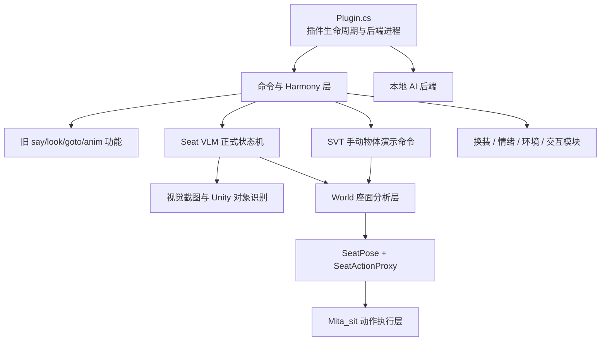
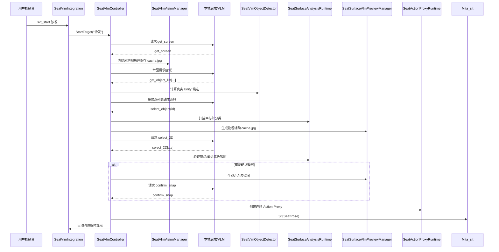

# MakemitAGA 项目架构与维护手册

> 文档对应版本：**Miside AI Modular 0.2.2 / Seat VLM 正式整合版 + SVT 手动对象演示补丁**  
> 文档修订日期：**2026-06-27**  
> 目标环境：**MiSideFull / Unity 2021.3.35f1 / Windows x64 / IL2CPP / BepInEx 6**  
> 文档用途：在项目继续扩大之前，为后续开发者提供一份“先读这个就能继续工作”的源码地图。

---

## 0. 这份文档应该怎样使用

这份文档不是 API 自动生成结果，而是当前项目的**人工维护架构说明**。

新开发者建议按以下顺序阅读：

1. 先读“整体架构”和“不可破坏的设计约束”；
2. 再根据要修改的功能，查“修改某功能时应该去哪里”；
3. 最后阅读对应文件的“特别注意”；
4. 修改后按照“回归测试清单”逐项验证；
5. 架构发生变化时，同步更新本文件，而不是只在聊天记录里留下说明。

文档中提到的“正式 Seat VLM”指当前主流程：

```text
svt_start <目标>
→ 米塔视角截图
→ VLM 圈选目标区域
→ Unity 真实对象候选
→ VLM 选择真实对象
→ 深度扫描与座面分类
→ VLM 选择紫色动作有效点
→ 必要时吸附确认
→ 生成 SeatPose
→ 创建连续 SeatActionProxy
→ Mita_sit 执行坐下
→ 自动清理临时可视化
```

本次修订加入了**独立于正式 Seat VLM 的手动物体演示流程**：

```text
debug_svt_test(真实对象名)
→ 按真实名称选择最近的活动对象
→ 执行与正式流程一致的顶视深度扫描和座面分类
→ 显示青/绿/红/橙/紫分析网格
→ 不连接 VLM，不调用 Mita_sit，不覆盖正式分析结果

debug_svt_mesh(真实对象名)
→ 只显示来自 SeatSurface_ProxyMeshCollider 几何的青色完整高度图

svt_test_clear
→ 只清理手动测试展示
→ 不影响 svt_start、正式分析 Collider 或 SeatActionProxy
```

该功能由新增的 `World/SeatSurfaceManualDebugTest.cs` 承担，并使用独立对象列表、Renderer 列表和扫描序号管理生命周期。

---

# 1. 项目的一分钟总览

MakemitAGA 当前由六个主要层组成：



六层职责：

| 层 | 主要目录/文件 | 职责 |
|---|---|---|
| 插件生命周期层 | `Plugin.cs` | 初始化、场景切换、Harmony、后端进程、主线程 Tick |
| 通信层 | `Connection/`、`BackendSource/` | HTTP、健康检查、流式读取、模型请求 |
| 命令与游戏钩子层 | `DialoguePatches.cs`、`VisionPatches.cs`、`SeatVlmIntegration.cs` | 控制台命令分发、Harmony 拦截 |
| 感知与选择层 | `SeatVlmVisionManager`、`SeatVlmObjectDetector`、`SeatVlmController` | 截图、候选对象、工具协议、状态机 |
| 世界几何层 | `World/SeatSurface*.cs`、`SeatActionProxy.cs` | 深度扫描、座面分析、物理代理、手动物体演示 |
| 角色动作层 | `Mita_sit.cs` | 寻路、控制权、动画、IK、坐姿锁、起身恢复 |

---

# 2. 当前最重要的设计边界

这些约束是项目稳定性的基础。修改代码时，优先保证它们不被破坏。

## 2.1 环境理解面与动作执行面必须分离

项目存在两种表面：

### A. `SeatSurfaceAnalysisRuntime` 生成的稀疏分析网格

用途：

- 表示完整目标家具；
- 保留靠背、扶手、坐垫等多个高度岛；
- 判断承重、坡度、边缘、站立空间、腿部空间；
- 为 `select_2D` 和最近有效点吸附提供物理查询。

它是**环境理解层**，不是最终动画支撑面。

### B. `SeatActionProxyRuntime` 生成的小型连续平面

用途：

- 围绕最终确定的座点创建稳定、连续、法线一致的薄面；
- 给 `Mita_sit` 提供稳定动作基准；
- 避免完整高度图的三角形接缝、噪声和局部尖角干扰动画。

它是**动作执行层**。

禁止重新把整个家具简化成一个大平面，也不建议让米塔直接长期依赖完整分析网格执行坐姿。

---

## 2.2 调试显示与物理 Collider 生命周期必须分离

`debug_svt` 只控制 Renderer 是否显示。

```text
debug_svt off
≠
删除分析 MeshCollider
≠
删除 Action Proxy Collider
```

`svt_clear` 与自动完成清理会：

- 清理黄色射线、候选框、截图相机和临时标记；
- 隐藏彩色分类 Renderer；
- **保留分析 MeshCollider**；
- **保留当前动作代理 Collider**。

场景切换才执行完整销毁。

---

## 2.3 Unity API 必须在主线程使用

HTTP 请求可以在后台任务中运行，但以下操作必须回到 Unity 主线程：

- `GameObject.Find`
- `Instantiate` / `Destroy`
- `GetComponent`
- `Camera.Render`
- `Renderer.enabled`
- `Mesh` / `MeshCollider`
- `NavMesh`
- Animator 与 FinalIK

`Plugin.MainThreadRunner.Update()` 是主线程状态机驱动点。不要从 `Task` 回调直接操作 Unity 对象。

---

## 2.4 场景引用不能跨场景复用

MiSide 切换菜单、Loading、章节场景时，旧 Unity 对象会失效。

场景切换必须清理：

- 摄像机和 SnapshotCamera；
- Renderer 缓存；
- House/Room/Target 缓存；
- Seat VLM 状态；
- 分析网格和 Action Proxy；
- `Mita_sit` 的动作控制权、IK 引用和坐姿锁；
- EnvironmentManager 的场景引用。

所有新增静态模块都应该提供：

```csharp
ClearSceneReferences()
ResetForSceneChange(...)
ClearAll()
```

中的至少一种。

---

## 2.5 VLM 截图材质替换必须是原子的

辅助图需要临时把场景替换为白色背景、灰色目标和彩色分类面。

正确流程必须是：

```text
WaitForEndOfFrame
→ 临时修改 Renderer/Material
→ 私有相机 Camera.Render
→ ReadPixels
→ 同步恢复所有现场状态
→ 恢复后才 yield
```

中间不能 `yield return null`，否则主游戏相机会在下一帧看到灰白材质，造成“世界闪灰”。

---

## 2.6 AssetBundle 必须继续使用 iCall 路线

MiSide IL2CPP 环境中，普通 `AssetBundle.LoadFromFile` 曾出现不稳定和重复加载问题。

深度资源必须继续通过：

```text
IL2CPP.ResolveICall
AssetBundle::LoadFromFile_Internal
AssetBundle::LoadAsset_Internal
```

并缓存 Bundle 指针和资源。

同一游戏进程中不要让多个 DLL 重复加载 `mita_actions`。

---

## 2.7 IL2CPP 注入类不要暴露不支持的方法签名

`Mita_sit` 是自定义 IL2CPP `MonoBehaviour`。

以下纯托管签名必须使用 `[HideFromIl2Cpp]`：

- `IEnumerator`
- `SeatPose` 等普通托管对象参数
- `System.Object`
- 反射辅助方法

否则 Il2CppInterop 会输出 unsupported parameter/return type 警告，甚至在某些版本中导致注入失败。

---

## 2.8 Seat VLM 的磁盘输出规则

默认情况下，运行时允许写入：

```text
BepInEx/plugins/cache.jpg
BepInEx/plugins/config.json
```

后端调试文件默认关闭：

```json
"WRITE_BACKEND_DEBUG_FILE": false
```

开启时只允许生成：

```text
BepInEx/plugins/backend_debug.txt
```

不要重新引入：

```text
backend_boot.log
backend_last_prompt.txt
backend_last_reply.txt
seat_vlm_result.json
seat_surface_preview_meta.json
```

模型交互过程应继续实时输出到 BepInEx 控制台。

---

## 2.9 正式 SVT 与手动测试展示必须拥有独立生命周期

手动演示命令用于在不经过 VLM 的情况下，按 Unity Explorer 中看到的真实对象名重建座面分析效果。它不能复用正式流程的对象所有权。

正式流程使用：

```text
_created
_debugRenderers
_scanSerial
_scanInProgress
```

手动测试使用：

```text
_manualDebugCreated
_manualDebugRenderers
_manualDebugScanSerial
_manualDebugScanInProgress
```

必须保持以下语义：

| 操作 | 正式 Seat VLM | 手动测试展示 |
|---|---|---|
| `svt_clear` | 清理正式临时展示并保留正式 Collider | 不删除、不隐藏 |
| `debug_svt on/off` | 控制正式调试 Renderer | 不控制 |
| `svt_test_clear` | 不影响 | 取消扫描并销毁全部手动测试对象 |
| 新的手动测试命令 | 不覆盖正式最后分析结果 | 先替换旧手动测试结果 |
| 场景切换/插件卸载 | 完整清理 | 完整清理 |

额外约束：

1. 正式扫描进行中时，手动测试必须拒绝启动，避免两个扫描相机同时修改目标 Layer；
2. 手动测试构建的 `MeshCollider` 必须禁用，只把网格作为展示几何，不能产生重复物理碰撞；
3. 同名对象按完整名称、不区分大小写匹配，并选择离主游戏摄像机最近且具有可用 Bounds 的活动对象；
4. 手动测试不连接后端、不启动 VLM、不调用 `Mita_sit`；
5. C# 协程不能在带 `catch` 的 `try` 中使用 `yield`。手动测试采用 `ManualDebugScanRoutineCore()` 的 `try/finally` 执行扫描，再由外层 `MoveNext()` 包装器捕获异常，避免 `CS1626`。

---

# 3. 启动与生命周期

## 3.1 插件启动顺序

`Plugin.Load()` 当前顺序：

```text
1. 初始化全局 Logger / Instance
2. 读取 plugins/config.json，并初始化换装状态
3. 注册 SceneManager.sceneLoaded
4. 挂载 MainThreadRunner
5. 注册 Mita_sit IL2CPP 类型
6. 启动 OnlineAIApiServer.exe
7. 初始化 Seat VLM
8. 应用视觉、对话、互动、坐姿控制权和换装 Harmony 补丁
```

这个顺序不要随意调整：

- 配置必须在启动后端前完成；
- `Runner` 必须在需要协程前存在；
- `Mita_sit` 类型必须注册后才能按需 AddComponent；
- Seat VLM 必须在控制台命令被调用前初始化。

## 3.2 每帧主线程

`MainThreadRunner.Update()` 当前负责：

```text
检查后端是否意外退出
SeatVlmController.Tick()
```

如果以后引入新的后台任务，应尽量复用统一的主线程调度，而不是再创建多个永久 Runner。

## 3.3 场景切换

`Plugin.OnSceneLoaded()`：

```text
EnvironmentManager.ClearState()
SeatVlmIntegration.ResetForSceneChange(...)
  ├─ ClearAll() 清理正式分析对象
  ├─ ClearManualDebugTest(..., false) 清理手动测试对象
  └─ ClearAll() 清理 Action Proxy
EnvironmentManager.Init()
```

`Mita_sit` 另外在自身 `Update()` 中轮询 Active Scene，防止旧坐姿锁污染新场景。

## 3.4 卸载和退出

插件卸载与游戏退出时必须：

- 取消 Seat VLM；
- 销毁相机、正式分析网格和 Action Proxy；
- 取消仍在运行的手动测试扫描并销毁其展示对象；
- 恢复角色状态；
- 关闭后端进程。

---

# 4. Seat VLM 状态机

状态定义：

```text
Idle
WaitingForGetScreen
PreparingOriginalScreen
WaitingForObjectRegion
WaitingForObjectSelection
BuildingSeatSurface
CapturingAuxiliary
WaitingForSurfacePoint
CapturingSnapFeedback
WaitingForSnapDecision
Completed
Failed
Cancelled
```

典型工具顺序：

```text
get_screen
get_object_list[left,top,width,height]
select_object(id)
select_2D[x,y]
confirm_snap
```

重要规则：

1. 每轮模型只能输出一个完整 `<tool_call>...</tool_call>`；
2. `svt_start` 必须带目标参数；
3. `select_object` 只能选择 Unity 返回的真实候选；
4. 首次 `select_2D` 使用单独辅助图坐标；
5. 只有物理无效时才生成左右吸附反馈图；
6. 反馈阶段的 `select_2D` 仍使用右侧辅助面板局部坐标；
7. 完成后创建 `SeatPose` 和 Action Proxy，然后调用 `Mita_sit`；
8. 完成后自动清理临时展示，但保留 Collider。

---

# 5. Seat VLM 数据流



---

# 6. 源码目录与建议阅读顺序

## 6.1 推荐阅读顺序

### 只想理解 Seat VLM

```text
Plugin.cs
SeatVlmIntegration.cs
SeatVlmController.cs
SeatVlmVisionManager.cs
SeatVlmObjectDetector.cs
World/SeatSurfaceAnalysisMesh.cs
World/SeatSurfaceScanCapture.cs
World/SeatSurfaceSeatability.cs
World/SeatSurfaceManualDebugTest.cs
World/SeatSurfaceSelectionLifecycle.cs
World/SeatActionProxy.cs
Mita_sit.cs
```

### 只想修改对话和旧命令

```text
DialoguePatches.cs
AIConversationManager.cs
MitaVisionManager.cs
ObjectDetector.cs
GameUIManager.cs
```

### 只想修改后端

```text
ClothChange.cs / SharedConfig
SeatVlmAIClient.cs
BackendSource/online_api_server.py
Plugin.cs / StartBackendServer
```

### 只想修改手动物体演示

```text
SeatVlmIntegration.cs
World/SeatSurfaceManualDebugTest.cs
World/SeatSurfaceSeatability.cs
World/SeatSurfaceVisualization.cs
MakemitAGA.csproj
```

---

# 7. 每个文件的职责与维护注意事项

## 7.1 根目录

### `MakemitAGA/Plugin.cs`（约 376 行）

**定位**

整个插件的唯一 BepInEx 入口和顶层生命周期所有者。

**核心职责**

- 初始化日志、配置和模块；
- 创建 `MainThreadRunner`；
- 注册 `Mita_sit` IL2CPP 类型；
- 启动、监控、关闭 `OnlineAIApiServer.exe`；
- 将后端 stdout/stderr 实时转发至 BepInEx；
- 应用 Harmony 补丁；
- 场景切换时清理所有场景状态。

**关键方法**

- `Load()`
- `OnSceneLoaded(...)`
- `StartBackendServer()`
- `RestartBackendServer()`
- `PollBackendProcess()`
- `KillBackend()`

**特别注意**

- 不要在 `Load()` 中立即实例化复杂场景对象；菜单阶段很多游戏对象不存在；
- 后端配置路径通过环境变量传入，C# 与 Python 必须保持一致；
- 新增长期运行模块时，必须同步补充 `Unload()` 和场景清理；
- 不要在这里加入复杂业务流程，Plugin 应保持“编排者”角色。

---

### `MakemitAGA/MakemitAGA.csproj`（约 433 行）

**定位**

Visual Studio/MSBuild 项目文件，维护所有源码和游戏/框架引用。

**本次变化**

新增编译项：

```xml
<Compile Include="World\SeatSurfaceManualDebugTest.cs" />
```

**特别注意**

- 新增 `.cs` 文件后必须同步加入项目编译项，否则文件存在但不会进入 DLL；
- 引用路径继续以本机 BepInEx `interop` 和 Unity 模块为准；
- 不要把测试项目的独立命名空间或 DLL 引用带入主项目；
- 合并补丁后应确认项目中只存在一份 `SeatSurfaceManualDebugTest.cs`。

---

### `INTEGRATION_NOTES.md`（约 99 行）

**定位**

版本级整合说明和迁移记录。

**适合记录**

- 版本新增功能；
- 文件迁移；
- 配置格式变化；
- 兼容性变化；
- 用户升级步骤。

**不适合记录**

- 每个类的长期职责；
- 完整调用图；
- 所有维护约束。

这些内容应以本 `PROJECT_ARCHITECTURE.md` 为准。

---

## 7.2 `Connection/`

### `Connection/AIConversationManager.cs`（约 67 行）

**定位**

旧 `say` / `look` 功能的轻量 HTTP 客户端。

**原理**

向本地 `http://127.0.0.1:8080/` 发送纯文本；`look` 请求通过 Header 明确要求附加图片。

**特别注意**

- 它不是 Seat VLM 正式客户端；
- 不要把 Seat VLM 的状态 Header、重试和工具协议重新塞进这里；
- 旧功能仍依赖它，因此不能简单删除。

---

### `Connection/SeatVlmAIClient.cs`（约 324 行）

**定位**

Seat VLM 专用 HTTP 客户端。

**核心职责**

- 等待 `/health`；
- 携带 Run、Request、State、Protocol、Include-Image Header；
- 分块读取响应并把片段送入控制台；
- 处理有限次数重试；
- 区分临时 HTTP 状态与永久错误。

**特别注意**

- 本类可以在后台线程执行网络工作，但不能操作 Unity 对象；
- 回调结果必须由 `SeatVlmController.Tick()` 在主线程消费；
- 不要在这里写 prompt/reply 文件；
- 改超时时间时同时检查 `SeatVlmConfig` 与 `config.json`。

---

## 7.3 `Dialogue/`

### `Dialogue/GameUIManager.cs`（约 104 行）

**定位**

利用游戏原生 `Dialogue_3DText` 显示 AI 长文本。

**原理**

- 复用原生预制件；
- 按标点拆句；
- 让游戏原生 Start 完成排版初始化；
- 通过 `PendingInjections` 注入文本；
- 阅读完成后让字符物理掉落。

**特别注意**

- `Dialogue_3DText` 的初始化顺序不能被跳过；
- 同一时间只保留一个 `_currentSequenceRoutine`；
- 不要从网络线程直接调用 `Instantiate`。

---

## 7.4 `Mita_self/`

### `Mita_self/ClothChange.cs`（约 405 行）

**定位**

换装、光标、共享配置持久化模块。

**核心职责**

- 定义 `SharedConfig`；
- 维护 API、模型、超时、调试文件和服装字段；
- 读取/写入 `BepInEx/plugins/config.json`；
- 管理服装与光标；
- 读取游戏原生解锁存档；
- 在 `MitaClothes.Start` 后恢复服装。

**特别注意**

- C# 与 Python 后端共用这一份 JSON；
- 新增后端配置字段时必须同时修改：
  1. `SharedConfig`
  2. `BackendSource/online_api_server.py`
  3. `BackendSource/config.example.json`
  4. 本架构文档
- `SaveConfigToJson()` 会自动补全新字段；
- API Key 属于用户私密配置，不应写入日志或示例文件。

---

### `Mita_self/DialoguePatches.cs`（约 695 行）

**定位**

旧控制台命令总入口、旧对话/视觉/寻路功能和 AI 移动控制。

**核心职责**

- 拦截 `ConsoleCommandsGame.Command`；
- 优先转交 `SeatVlmIntegration.TryHandleConsoleCommand`；
- 处理 `say`、`look`、`goto`、`come`、`anim`、`faceid`、`sit`；
- 旧视觉请求；
- 目标查找和 NavMesh 移动；
- 阻断原生 Magnet / Follow。

**特别注意**

- 这是大型历史文件，新增命令前先判断是否应放入独立模块；
- Seat VLM 命令应继续由 `SeatVlmIntegration` 管理；
- `IsAIControlled` 的获取与释放必须成对；
- 修改 `WalkToObj` 时要回归测试自动跟随、动画和急停；
- 控制台命令解析不要和工具协议解析混在一起。

---

### `Mita_self/EmotionController.cs`（约 79 行）

**定位**

表情与情绪参数控制的轻量模块。

**核心职责**

- 缓存 Animator；
- 根据情绪名设置脸部参数或动画状态。

**特别注意**

- Animator 可能随场景重建；
- 修改参数名必须依据当前游戏 Controller 验证；
- 不要让情绪层覆盖坐姿身体动画层。

---

### `Mita_self/InteractionManager.cs`（约 272 行）

**定位**

旧资源型交互动作和原生脚本阻断模块。

**核心职责**

- 加载互动动画资源；
- 执行旧式坐下/交互；
- 修改游戏脚本字段；
- 在自定义交互时阻断部分原生 Update；
- 使用程序集限定名精确解析 Harmony 目标，避免枚举整个 Assembly-CSharp。

**特别注意**

- 该模块与正式 `Mita_sit` 不是同一套坐姿系统；
- 不要让旧 `PerformSit` 成为 Seat VLM 的执行入口；
- 反射和字段名高度依赖游戏版本；
- Harmony 目标解析不要改回字符串 `[HarmonyPatch("Type", ...)]`，否则可能再次触发 `OptionValue` Warning。

---

### `Mita_self/MitaVisionManager.cs`（约 126 行）

**定位**

旧 `look` 功能使用的米塔视角相机。

**核心职责**

- 挂载米塔头部相机；
- 生成旧流程 `SnapshotCamera`；
- 保存 `cache.jpg`；
- 允许视角切换。

**特别注意**

- 正式 Seat VLM 使用的是 `SeatVlmVisionManager`；
- 两套视觉系统目前并存，修改相机命名和缓存时需避免相互销毁；
- 如果未来统一视觉模块，应先保证旧 `look` 兼容。

---

### `Mita_self/ObjectDetector.cs`（约 190 行）

**定位**

旧视觉功能的屏幕框选 → Unity 对象查找器。

**原理**

- 将 AI 坐标转换为 Unity Viewport；
- 合并父子 Renderer Bounds；
- 计算屏幕投影矩形重叠；
- 返回候选对象。

**特别注意**

- 正式 Seat VLM 使用 `SeatVlmObjectDetector`；
- 两个 Detector 的坐标协议不同，不要混用；
- 旧 Detector 仍服务旧 `look` 流程。

---

### `Mita_self/VisionPatches.cs`（约 28 行）

**定位**

视觉相机与米塔 `LateUpdate` 的桥接补丁。

**核心职责**

- 每帧向旧视觉管理器和 Seat VLM 视觉管理器提供最新 `MitaPerson`；
- 让头部相机在动画之后校正姿态。

**特别注意**

- LateUpdate 是为了避免 Animator 更新后相机滞后；
- 这里应保持极轻量，不要增加扫描或网络逻辑；
- 每帧异常日志必须限流，否则会刷屏。

---

## 7.5 `Mita_self/Mita_tools/`

### `CreateTestObject.cs`（约 65 行）

**定位**

创建旧 `sit(name)` 测试方块。

**特别注意**

- 只用于人工测试；
- 正式 Seat VLM 不依赖它；
- 重复执行必须复用对象，避免测试场景累积。

---

### `Il2CppAssetBundleLoader.cs`（约 253 行）

**定位**

IL2CPP AssetBundle iCall 稳定加载器。

**核心职责**

- 延迟解析 iCall；
- 加载 Bundle；
- 枚举资源名；
- 加载深度 Material / Shader；
- 缓存 Bundle 指针和资源。

**特别注意**

- 同一进程只加载一次同一 Bundle；
- 不要在静态构造器里集中 Resolve；
- 不要使用泛型 `LoadAsset<T>`；
- 资源名使用文件名宽松匹配；
- 如果出现“same files already loaded”，先排查重复 DLL，而不是循环重试。

---

### `Mita_sit.cs`（约 2661 行）

**定位**

米塔坐下与起身的正式动作执行器，是当前最大的角色控制文件之一。

**核心职责**

- 兼容旧 `Sit(string)`；
- 正式接收 `SeatPose`；
- 获取米塔、Animator、NavMeshAgent 和 FullBodyBipedIK；
- 暂时接管原生移动控制；
- 走到 `FloorPoint`；
- 面向 `OutwardDirection`；
- 播放坐下动画并平滑移动 Root；
- 设置左右脚 IK；
- 长期锁定坐姿；
- 起身时反向采样动画并安全恢复；
- 场景切换或异常时强制还原。

**关键结构**

- `MitaSitOwnershipPatches`
- `Mita_sit`
- `SeatProbe`
- `FootProbeResult`

**特别注意**

1. 所有原始 Animator、NavMesh、IK 状态必须备份并恢复；
2. `AcquireActionControl()` 与 `ReleaseActionControl()` 必须成对；
3. 所有协程异常路径都必须释放控制权；
4. 正式 SeatPose 路径不应重新猜测座点；
5. 脚部存在四种情况：
   - 双脚支撑
   - 左支撑右悬空
   - 右支撑左悬空
   - 双脚悬空
6. 不要把 FinalIK target 直接设为 null，部分游戏脚本会假设 target 始终存在；
7. 自定义 IL2CPP MonoBehaviour 的纯托管方法必须 `[HideFromIl2Cpp]`；
8. 修改坐姿参数后必须测试：
   - 床
   - 沙发
   - 高凳
   - 低凳
   - 单脚有支撑
   - 双脚悬空
   - 中途取消
   - 场景切换。

**未来建议**

这个文件仍超过 2600 行，适合下一轮按以下职责拆分：

```text
MitaSitLifecycle.cs
MitaSitNavigation.cs
MitaSitAnimation.cs
MitaSitIK.cs
MitaSitEnvironmentProbe.cs
MitaSitReflectionCompat.cs
```

---

### `SeatSurfaceVlmPreviewManager.cs`（约 2896 行）

**定位**

生成 Seat VLM 辅助图和吸附反馈图。

**核心职责**

- 复制 `get_screen` 的冻结 SnapshotCamera；
- 生成单张辅助图；
- 生成左右反馈组合图；
- 临时隐藏米塔和玩家 `Person`；
- 将非目标环境改为白色、目标改为灰色；
- 保留分类色；
- 原子应用并恢复材质；
- 使用私有正交相机合成两张图；
- 保存唯一的 `cache.jpg`。

**特别注意**

- 所有现场材质和 Renderer 修改必须在一次同步方法内恢复；
- 玩家根节点已验证为 `GameObject.Find("Person")`；
- 不要扩大到 `Person.transform.parent`，否则可能影响 MainCamera；
- 组合图右半部分的选择坐标仍是局部 0~1；
- House Renderer 缓存必须在场景变化时失效；
- 这个文件接近 2900 行，是另一个未来拆分热点。

**未来建议拆分**

```text
SeatPreviewCapture.cs
SeatPreviewSceneMask.cs
SeatPreviewComposition.cs
SeatPreviewCamera.cs
SeatPreviewLifecycle.cs
```

---

### `SeatVlmConfig.cs`（约 109 行）

**定位**

Seat VLM 协议常量和工具说明文本。

**核心职责**

- 后端 URL；
- 最大轮次；
- 等待和截图超时；
- 工具白名单和严格格式；
- 构建发给模型的工具规范。

**特别注意**

- 新增工具时必须同步修改 Controller 解析和执行；
- 工具描述必须明确坐标系、阶段和单工具限制；
- 不要重新加入无参数默认 `svt_start` 语义。

---

### `SeatVlmController.cs`（约 1963 行）

**定位**

Seat VLM 的核心有限状态机和工具协议执行器。

**核心职责**

- 管理完整运行状态；
- 构建每轮 Prompt；
- 发起模型请求；
- 主线程处理返回结果；
- 严格解析单个工具标签；
- 执行每个工具；
- 调用视觉、对象候选、表面分析、预览和 Action Proxy；
- 输出最终结果到控制台；
- 自动调用 `Mita_sit`；
- 自动清理临时展示。

**特别注意**

- 任何工具必须在正确状态执行；
- 后台网络结果通过队列回到主线程；
- 一个模型回复只能包含一个工具；
- 标签修复只允许白名单工具的单个末尾缺失闭合情况；
- 状态失败后不能继续执行后续回调；
- `_runSerial` / `_requestSerial` 用于拒绝旧请求结果；
- 不写 result JSON；
- 这是接近 2000 行的大文件，未来可按：
  - State
  - Prompt
  - ToolParser
  - ToolExecutor
  - RequestLifecycle
  拆分。

---

### `SeatVlmDebugVisuals.cs`（约 149 行）

**定位**

黄色搜索射线、候选框、最终命中点的调试可视化。

**特别注意**

- 默认隐藏；
- 只能由 `debug_svt` 控制；
- `ClearAll()` 只清理本模块创建的调试对象；
- 不要把分析 MeshCollider 放入本模块生命周期。

---

### `SeatVlmIntegration.cs`（约 420 行）

**定位**

正式 Seat VLM、手动 SVT 演示命令的统一控制台入口，以及跨模块生命周期协调器。

**正式命令**

```text
svt_start <目标>
svt_status
svt_cancel
svt_clear
debug_svt
debug_svt on/off
svt_backend_status
svt_backend_restart
```

**手动演示命令**

```text
debug_svt_test(Bed)
debug_svt_test Bed
debug_svt_mesh(Bed)
debug_svt_mesh Bed
svt_test_clear
```

**特别注意**

- `svt_start` 缺参数只能显示用法；
- `svt_clear` 必须保留正式分析 Collider 与动作 Collider，并且不得删除或隐藏手动测试展示；
- `svt_test_clear` 只调用 `ClearManualDebugTest`；
- `debug_svt` 只控制正式调试 Renderer，不接管手动测试 Renderer；
- `ResetForSceneChange` 和 `Shutdown` 必须同时清理正式结果与手动测试结果；
- 调试状态必须同时传给：
  - `SeatVlmDebugVisuals`
  - `SeatSurfaceAnalysisRuntime`
  - `SeatActionProxyRuntime`
- 自动完成清理统一调用 `ClearTransientArtifacts`，不要在 Controller 中重复写销毁逻辑；
- 命令参数同时支持括号形式和空格形式，解析时不要退回模糊对象搜索。

---

### `SeatVlmObjectDetector.cs`（约 174 行）

**定位**

把模型给出的二维区域转成真实 Unity 对象候选。

**核心职责**

- 在 House/Room 层级收集候选根；
- 合并 Renderer Bounds；
- 投影到冻结相机；
- 计算区域重叠；
- 排除人物、工具对象、异常大对象；
- 生成带 id、名称、路径、Bounds 的候选 JSON。

**特别注意**

- 候选列表必须来自真实 Unity 对象；
- `select_object` 不能接受模型虚构对象；
- Renderer Bounds 比 Collider 更适合作为视觉候选依据；
- 缓存场景根时必须记录 Scene Handle。

---

### `SeatVlmTargetPointSelector.cs`（约 130 行）

**定位**

从候选列表中解析模型选择。

**支持**

- 数字 id；
- 精确候选名称。

**特别注意**

- 不做模糊场景全局搜索；
- 如果名称不唯一，应返回失败而不是猜测；
- 防止模型绕过候选列表。

---

### `SeatVlmVisionManager.cs`（约 488 行）

**定位**

Seat VLM 正式米塔头部视觉相机。

**核心职责**

- 找到 `MitaPerson/Head`；
- 创建内部 Camera；
- 截图前进入准备状态；
- 在 Mita LateUpdate 后连续同步若干帧；
- 冻结世界位置、旋转和相机参数；
- 创建 SnapshotCamera；
- 保存 `cache.jpg`；
- 场景切换时销毁所有相机引用。

**特别注意**

- 准备阶段存在同步计数和超时；
- 截图相机必须使用当前 Mita 的头部姿态；
- 后续选点必须基于同一 SnapshotCamera；
- 不要在截图完成后立即销毁 SnapshotCamera，辅助图还要复用；
- 唯一磁盘图片是 `cache.jpg`。

---

### `TopSurfaceSeatProxyPlugin.cs`（约 21 行）

**定位**

旧入口兼容层。

**特别注意**

- 不再注册旧热键和 `ts_*` 命令；
- 新代码不要继续在这里扩展；
- 保留它只是为了旧调用方编译兼容。

---

### `TopSurfaceSeatProxyRuntime.cs`（约 27 行）

**定位**

旧类型名兼容代理。

**特别注意**

- 真正实现已经移动到 `World/SeatSurfaceAnalysis*.cs`；
- 不要把 Mesh 生成逻辑重新复制回来；
- 新调用优先直接使用 `SeatSurfaceAnalysisRuntime`。

---

## 7.6 `World/`

### `World/EnvironmentManager.cs`（约 451 行）

**定位**

场景光照、时间、颜色和视觉特效管理器。

**核心职责**

- 自动捕获当前场景环境基准；
- 修改时间和色调；
- 平滑过渡；
- 黑屏、血屏、负片、花屏、电视闪烁；
- 场景切换清理静态引用。

**特别注意**

- 初始化前必须 `ClearState()`；
- 不要缓存跨场景 Material/Component；
- 协程必须由 `Plugin.Runner` 执行；
- Seat VLM 的白色辅助材质不属于 EnvironmentManager。

---

### `World/SeatActionProxy.cs`（约 367 行）

**定位**

SeatPose 数据结构和连续动作代理平面生成器。

**`SeatPose` 保存**

- `Target`
- `SeatPoint`
- `SurfaceNormal`
- `OutwardDirection`
- `SeatRightDirection`
- `FloorPoint`
- `SeatRotation`
- `HeightAboveFloor`
- `SupportWidth`
- `SupportDepth`
- `WasSnapped`
- `Confidence`
- `ActionProxy`

**核心职责**

- 从最终选择结果创建 `SeatPose`；
- 构建薄型连续 MeshCollider；
- 默认隐藏 Renderer；
- `debug_svt` 时显示紫色代理；
- 新座点替换旧代理；
- 场景切换完整清理。

**特别注意**

- Action Proxy 应保持小而稳定；
- 不要用它替代完整分析网格；
- 坐姿执行过程中不能被 `svt_clear` 销毁；
- 修改尺寸时要同步测试不同体型家具与 Mita Root 滑入距离。

---

### `World/SeatSurfaceAnalysisMesh.cs`（约 947 行）

**定位**

七个 partial 文件的共享核心和主扫描编排。

**包含**

- `FakeColliderMode`
- `FakeColliderRequest`
- `SeatSurfaceSelectionResult`
- `SeatSurfaceAnalysisRuntime` 的共享字段/常量
- `DepthPath`
- `HeightfieldStats`
- `SeatabilityStats`
- `SeatCandidatePoint`
- 扫描主协程 `ScanTargetRoutine`

**特别注意**

- 所有 partial 文件共享同一静态状态；
- 字段和嵌套类型只在这里定义；
- 不要在其他 partial 中重复字段；
- 修改网格参数前理解其影响范围：
  - 扫描分辨率
  - 高度连接阈值
  - 座面高度
  - 足迹范围
  - 人体 clearance
- 正式入口：
  - `RunTargetSeatabilityTest`
  - `TrySelectActionPoint`
  - `TryFindNearestActionPoint`

---

### `World/SeatSurfaceScanCapture.cs`（约 951 行）

**定位**

目标扫描体积、深度捕获和高度图重建。

**流程**

```text
计算目标完整 Bounds
→ 设置顶部正交深度相机
→ EyeDepthReplacement 优先
→ DepthToEye 备用
→ 像素反投影成世界高度
→ 网格采样
→ 空洞填充
→ 小岛过滤
→ 高度平滑
→ 按高度差生成三角形
```

**特别注意**

- Top 模式必须覆盖目标完整粗略高度；
- Renderer Bounds 决定视觉 X/Z；
- 过滤后的非 Trigger Collider 只补充 Y；
- 不能恢复旧的固定 0.70m 顶部薄层；
- 多高度层过滤阈值必须允许沙发靠背与坐垫共存；
- 三角形连接仍需限制高度差，避免把不同高度岛缝成墙；
- 深度路径异常时要记录实际使用的 `DepthPath`。

---

### `World/SeatSurfaceSeatability.cs`（约 1132 行）

**定位**

把高度图分类成“不可用、可承重、警告、动作有效”，并为正式扫描与手动测试共用同一批处理分析实现。

**主要判定**

- 表面法线与坡度；
- 支撑覆盖率；
- 局部平整度；
- 座面离地高度；
- 最近边缘与外侧方向；
- FloorPoint；
- NavMesh 可达性；
- 站立胶囊；
- 接近走廊；
- 腿部空间；
- 角色/目标 Collider 排除。

**颜色语义**

```text
青：完整分析表面
绿：可承重
红：不可用
橙：高度软警告
紫：适合坐姿动作
```

**本次变化**

`AnalyzeSeatabilityBatched(...)` 增加手动测试标记，并通过不同序号判断取消：

```text
正式扫描：_scanSerial
手动测试：_manualDebugScanSerial
```

这样 `svt_test_clear` 可以中止手动分析，而不会取消正式 `svt_start`；反过来，正式流程的取消也不会误伤已经完成的手动展示。

**特别注意**

- “可承重”不等于“动作有效”；
- 紫色必须同时满足接近、边缘、身体和腿部空间；
- 正式与手动流程必须共享判定算法，但不能共享取消序号和对象生命周期；
- 床、沙发、凳子的高度阈值可能需要分别演进，但不要用对象名称硬编码；
- 修改拒绝条件后观察 `reject*` 统计，避免一个条件吞掉全部候选。

---

### `World/SeatSurfaceManualDebugTest.cs`（约 963 行）

**定位**

按真实 Unity `GameObject.name` 手动运行座面扫描和分类，用于演示、调参和排查，不连接 VLM。

**公开入口**

```text
RunManualDebugTestByName(name, meshOnly, source)
ClearManualDebugTest(reason, printResult)
GetManualDebugTestStatus()
```

**支持命令**

```text
debug_svt_test(Bed)
debug_svt_mesh(Bed)
svt_test_clear
```

**对象选择规则**

1. 只枚举当前场景中 `activeInHierarchy` 的对象；
2. 名称完整匹配、不区分大小写；
3. 候选必须具有可用 Renderer/Collider Bounds；
4. 有多个同名对象时，选择离主游戏摄像机最近者；
5. 没有可用摄像机时回退到 `MitaPerson`，再失败则以世界原点为参考；
6. 距离完全相同时用完整层级路径稳定排序。

**两种显示模式**

- `FullDebug`：青色完整高度图、代理 MeshCollider 网格、绿色支撑区、红色无效区、橙色高度警告区、紫色动作有效区；
- `MeshOnly`：只显示来自 `SeatSurface_ProxyMeshCollider` 几何的青色完整高度图。

**生命周期**

- 使用 `_manualDebugCreated` 保存根对象；
- 使用 `_manualDebugRenderers` 保存 Renderer；
- 使用 `_manualDebugScanSerial` 取消旧协程；
- 新测试会先替换旧手动展示；
- `svt_clear` 和 `debug_svt` 不控制这些对象；
- `svt_test_clear`、场景切换和插件卸载负责销毁；
- 所有测试 `MeshCollider` 都会禁用，避免重复碰撞。

**IL2CPP/C# 协程注意**

C# 不允许在包含 `catch` 的 `try` 作用域中执行 `yield return` 或 `yield break`。当前实现分为：

```text
ManualDebugScanRoutineCore()
  → 真正的多帧扫描，只使用 try/finally

ManualDebugScanRoutine()
  → 手动推进 core.MoveNext()
  → 在无 yield 的 try/catch 中捕获异常
  → 在 catch 作用域外 yield core.Current
```

不要把这两层重新合并，否则会恢复六个 `CS1626` 编译错误。

**特别注意**

- 正式 `_scanInProgress` 为 true 时必须拒绝启动；
- 临时修改目标 Layer 后要尽早恢复，并在 `finally` 再次兜底；
- 手动 Renderer 从正式 `_debugRenderers` 中移除后再加入独立列表；
- 不得写入正式 `_lastResultRoot`、最终选择结果或 Action Proxy；
- 不得调用后端、`SeatVlmController` 或 `Mita_sit`。

---

### `World/SeatSurfaceVisualization.cs`（约 719 行）

**定位**

创建完整分析 MeshCollider、分类覆盖网格和调试体积。

**核心职责**

- 构建高度图 Mesh；
- 创建非凸 MeshCollider；
- 创建红/绿/橙/紫覆盖层；
- 创建动作 Marker、站立胶囊和腿部空间显示；
- 保留旧 `FakeCollider` 与局部代理兼容入口。

**特别注意**

- Renderer 默认隐藏，但 Collider 必须继续启用；
- 分类层可以有轻微 Y 偏移防止 Z-fighting；
- 不要为每个格子创建独立 Collider；
- Mesh 顶点列表必须使用 IL2CPP 可接受的集合转换；
- 调试材质应使用 Unlit，避免环境光改变颜色含义。

---

### `World/SeatSurfaceNavigation.cs`（约 756 行）

**定位**

分析层的方向、地面、NavMesh 与旧桥接辅助。

**核心职责**

- 估算家具边缘外侧方向；
- 寻找最近 NavMesh / 物理地面点；
- 路径长度估计；
- 创建隐藏 goto 点；
- 保留早期 Bed 测试桥接与反射调用。

**特别注意**

- 正式 Seat VLM 已经把结果转成 `SeatPose`；
- 带 `Bed`、`pending bridge` 名称的方法多为历史兼容逻辑；
- 新功能不要继续依赖硬编码 Bed；
- 如果未来删除旧桥接，先确认旧 `sit(name)` 和调试命令不再引用；
- `NavMesh.SamplePosition` 的 areaMask 使用 `-1`，避免某些 IL2CPP 版本缺失 `NavMesh.AllAreas`。

---

### `World/SeatSurfaceSceneQuery.cs`（约 497 行）

**定位**

目标 Bounds、场景层级、Raycast 和扫描 Layer 管理。

**核心职责**

- 合并 Renderer Bounds；
- 用过滤后的 Collider Bounds 扩展 Y；
- 选择空 Layer；
- 临时把目标放入扫描 Layer；
- 扫描结束后恢复所有 Layer；
- 猜测屏幕射线命中的家具根；
- 创建扫描体积调试框。

**特别注意**

- 视觉范围以 Renderer 为主；
- Trigger、巨大 Collider、房间根和任务对象要过滤；
- 任何临时 Layer 修改必须在 finally 中恢复；
- `GuessScanRoot` 的命名评分只应作为辅助，不应覆盖明确选择的真实目标。

---

### `World/SeatSurfaceSelectionLifecycle.cs`（约 1145 行）

**定位**

VLM 选点、最近紫色吸附、资源加载、调试可见性和清理生命周期。

**核心职责**

- 加载深度 Shader / Material；
- 把 Viewport 点投射到分析表面；
- 验证选择来源；
- 查找最近动作有效点；
- 为 Preview 提供 ResultRoot；
- 切换调试显示；
- 自动/手动清理并保留分析面；
- 创建基础材质和通用销毁工具。

**特别注意**

- `TrySelectActionPoint` 必须验证命中来自当前分析网格；
- 最近点吸附必须限定到紫色动作有效中心；
- `ClearTransientVisualsPreserveSurface` 不能删除分析 Collider；
- `ClearAll` 才能在场景切换时完整销毁；
- AssetBundle 资源加载失败不能静默继续生成无意义深度。

---

# 8. 后端文件

## `BackendSource/online_api_server.py`（约 409 行）

**定位**

本地 HTTP 中转后端，将 C# Prompt 和 `cache.jpg` 转发给上游多模态模型。

**核心职责**

- 读取 `plugins/config.json`；
- 提供 `/health`；
- 读取请求 Header 判断是否附图；
- 将 `cache.jpg` 编码为 Data URL；
- 调用 OpenAI 兼容 Chat Completions API；
- 将模型回复原样返回；
- stdout/stderr 实时输出；
- 可选合并写入 `backend_debug.txt`。

**特别注意**

- 默认必须无状态；
- `WRITE_BACKEND_DEBUG_FILE=false` 时不生成文本日志；
- 不要在后端过滤或“修正”工具标签；
- 工具协议验证由 C# Controller 完成；
- 重新修改 Python 后必须重新构建 EXE；
- API Key 不能出现在 stdout 或异常正文。

---

## `BackendSource/config.example.json`（约 14 行）

**定位**

配置字段模板，不应覆盖用户真实配置。

**特别注意**

- 示例 API_KEY 必须为空；
- 新增配置字段时同步更新 `SharedConfig` 和 Python；
- 默认调试文件开关保持 false。

---

## `BackendSource/BUILD_BACKEND.md`（约 36 行）

**定位**

Nuitka 构建说明。

**特别注意**

- 修改 Python 源码不等于游戏已使用新版本；
- 必须重新生成并替换 `OnlineAIApiServer.exe`；
- 构建后通过控制台确认后端版本号。

---

# 9. 修改某功能时应该去哪里

| 目标 | 首要文件 | 同步检查 |
|---|---|---|
| 新增控制台 Seat 命令 | `SeatVlmIntegration.cs` | `DialoguePatches.cs` 命令优先级 |
| 新增模型工具 | `SeatVlmConfig.cs` | `SeatVlmController` Parser、State、Executor |
| 修改 Prompt | `SeatVlmController.BuildPrompt` | 工具规范、当前状态、上一结果 |
| 修改 HTTP 重试 | `SeatVlmAIClient.cs` | config 超时字段、Controller 超时 |
| 修改截图姿态 | `SeatVlmVisionManager.cs` | `VisionPatches.cs` LateUpdate |
| 修改辅助图外观 | `SeatSurfaceVlmPreviewManager.cs` | 材质恢复、原子截图 |
| 修改候选对象 | `SeatVlmObjectDetector.cs` | Bounds、过滤、坐标系 |
| 修改扫描范围 | `SeatSurfaceScanCapture.cs` | SceneQuery Bounds 与高度过滤 |
| 修改座面规则 | `SeatSurfaceSeatability.cs` | reject 统计和紫色区域 |
| 修改手动物体演示 | `SeatSurfaceManualDebugTest.cs` | `SeatVlmIntegration`、`SeatSurfaceSeatability`、项目编译项 |
| 修改分类网格 | `SeatSurfaceVisualization.cs` | debug_svt、手动展示材质、Collider 生命周期 |
| 修改吸附策略 | `SeatSurfaceSelectionLifecycle.cs` | Controller 的反馈流程 |
| 修改动作代理尺寸 | `SeatActionProxy.cs` | Mita_sit Root 滑入和脚点 |
| 修改坐姿/起身 | `Mita_sit.cs` | Ownership Patch、Animator、IK、场景恢复 |
| 修改配置 | `ClothChange.cs` | Python、config.example、文档 |
| 修改后端日志 | `online_api_server.py` | Plugin stdout 转发、调试文件约束 |
| 修改旧 say/look | `DialoguePatches.cs` | AIConversationManager、MitaVisionManager |
| 修改环境光效 | `EnvironmentManager.cs` | 场景 ClearState / Init |

---

# 10. 控制台命令速查

## Seat VLM

```text
svt_start 沙发
svt_start 床
svt_start 凳子
svt_status
svt_cancel
svt_clear
debug_svt
debug_svt on
debug_svt off
svt_backend_status
svt_backend_restart
```

## SVT 手动物体演示

```text
debug_svt_test(Bed)
debug_svt_test Bed

debug_svt_mesh(Bed)
debug_svt_mesh Bed

svt_test_clear
```

语义：

- `debug_svt_test`：显示与正式 `debug_svt` 对应的完整分析网格，但不运行 VLM；
- `debug_svt_mesh`：只显示青色完整高度图；
- `svt_test_clear`：只清理手动测试对象；
- 名称必须与 Unity Explorer 中的真实 `GameObject.name` 完整相同；
- 存在重名对象时选择离主游戏摄像机最近、且具有可用 Bounds 的活动对象。

## 坐姿

```text
sit(TestChair_High)
sit(TestChair_Low)
```

正式 Seat VLM 完成后会自动调用 `Mita_sit.Sit(SeatPose)`，不需要用户手动输入 sit。

## 旧功能

实际支持项以 `DialoguePatches.InterceptCommand` 为准，主要包括：

```text
say
look
goto
come
anim
faceid
cloth*
cursor*
环境和特效命令
```

---

# 11. 运行时文件与配置

## 必需文件

```text
BepInEx/plugins/MakemitAGA.dll
BepInEx/plugins/OnlineAIApiServer.exe
BepInEx/plugins/mita_actions
BepInEx/plugins/config.json
```

## 运行时图片

```text
BepInEx/plugins/cache.jpg
```

它会被不同阶段覆盖，不是长期历史记录。

## 可选调试文件

```text
BepInEx/plugins/backend_debug.txt
```

仅当：

```json
"WRITE_BACKEND_DEBUG_FILE": true
```

时生成。

---

# 12. 日志分级约定

## `Info`

用于：

- 启动成功；
- 请求开始和完成；
- 正常工具调用；
- 扫描进度；
- 资源成功加载；
- Preview 成功；
- 自动清理；
- Action Proxy 创建。

## `Warning`

用于：

- 可恢复回退；
- 资源找不到但存在替代路径；
- 模型格式异常；
- 目标不唯一；
- 扫描数据不足；
- 状态不匹配；
- 可选 Harmony 目标不存在。

## `Error`

用于：

- 后端进程退出；
- HTTP 最终失败；
- AssetBundle 无法加载且没有替代；
- 截图/合成失败；
- IL2CPP 注入失败；
- 角色状态无法恢复。

框架在插件加载前输出的：

```text
Class::Init signatures have been exhausted, using a substitute!
```

属于 Il2CppInterop 自身日志，不是项目业务错误。

---

# 13. 回归测试清单

## 13.1 插件启动

- [ ] 插件只加载一次；
- [ ] 后端版本正确；
- [ ] `/health` 可用；
- [ ] config.json 自动补全字段；
- [ ] 默认不生成 backend 文本日志；
- [ ] BepInEx 控制台可看到后端 stdout。

## 13.2 Seat VLM 基础流程

- [ ] `svt_start` 无参数只显示用法；
- [ ] `svt_start 沙发` 完成完整工具链；
- [ ] `get_screen` 使用米塔视角；
- [ ] 候选列表来自真实 Unity 对象；
- [ ] 辅助图无米塔和玩家；
- [ ] 世界不会闪灰；
- [ ] 沙发靠背/扶手/坐垫同时进入扫描；
- [ ] 紫色动作有效区存在；
- [ ] 必要时左右反馈图正常；
- [ ] 最终创建 Action Proxy；
- [ ] 自动调用 Mita_sit；
- [ ] 自动清理后 Collider 仍存在。

## 13.3 调试显示

- [ ] 默认无黄色射线和彩色网格；
- [ ] `debug_svt on` 全部显示正式调试层；
- [ ] `debug_svt off` 只隐藏正式 Renderer；
- [ ] `svt_clear` 不破坏正在使用的 Action Proxy；
- [ ] `svt_clear` 不删除也不隐藏手动测试展示。

## 13.4 SVT 手动物体演示

- [ ] `debug_svt_test(Bed)` 可以按真实名称找到目标；
- [ ] 名称匹配不区分大小写，但不做包含或模糊匹配；
- [ ] 存在多个同名对象时选择距离摄像机最近者；
- [ ] 无 Renderer/Collider Bounds 的同名对象会被跳过；
- [ ] 完整模式显示青、绿、红、橙、紫层；
- [ ] `debug_svt_mesh(Bed)` 只显示青色完整高度图；
- [ ] 测试 MeshCollider 为 disabled，不影响角色碰撞；
- [ ] 正式扫描进行中时手动命令会拒绝启动；
- [ ] 新手动测试会替换旧手动测试结果；
- [ ] `svt_test_clear` 可以在分析中途取消；
- [ ] `svt_test_clear` 不影响正式分析面或 Action Proxy；
- [ ] 场景切换后手动测试对象和静态引用全部清除；
- [ ] 编译时不再出现 `CS1626`。

## 13.5 坐姿

- [ ] 正常走到 FloorPoint；
- [ ] 面向正确；
- [ ] 不发生延迟瞬移；
- [ ] 不被原生 Follow 抢回；
- [ ] 移动动画正常；
- [ ] 双脚有支撑正常；
- [ ] 单脚悬空正常；
- [ ] 双脚悬空自然；
- [ ] 起身不穿地；
- [ ] 中途取消能恢复；
- [ ] 场景切换能恢复。

## 13.6 场景切换

- [ ] 菜单 → Loading → 游戏无旧引用异常；
- [ ] 旧相机被销毁；
- [ ] 旧分析网格和 Action Proxy 被销毁；
- [ ] Mita_sit 控制权被释放；
- [ ] EnvironmentManager 重新初始化。

---

# 14. 当前大型文件与下一轮拆分优先级

| 文件 | 当前约行数 | 建议 |
|---|---:|---|
| `SeatSurfaceVlmPreviewManager.cs` | 2896 | 高优先级拆分：相机、场景遮罩、合成、生命周期 |
| `Mita_sit.cs` | 2661 | 高优先级拆分：导航、动画、IK、环境探测、反射兼容 |
| `SeatVlmController.cs` | 1963 | 中高优先级拆分：请求、Prompt、Parser、Executor、State |
| `DialoguePatches.cs` | 695 | 中优先级拆分：命令路由、旧视觉、移动、文本注入 |
| `SeatSurfaceSeatability.cs` | 1132 | 当前职责尚集中，可暂时保留 |
| `SeatSurfaceManualDebugTest.cs` | 963 | 手动演示职责集中；继续增长时可拆对象选择、扫描和生命周期 |

拆分原则：

1. 先机械拆分，不改变方法体；
2. 使用 `partial` 或内部服务类保持行为一致；
3. 每次只拆一个大文件；
4. 拆分后重组方法流进行文本校验；
5. 完成编译和完整回归后再继续重构。

---

# 15. 新增代码时的文件头模板

```csharp
/*
 * =================================================================================================
 * FileName.cs
 * =================================================================================================
 *
 * 作用：
 *   用一段话说明这个文件解决什么问题。
 *
 * 输入：
 *   列出主要输入对象、状态或参数。
 *
 * 输出：
 *   列出产生的对象、状态变化或返回值。
 *
 * 核心流程：
 *   1. ...
 *   2. ...
 *   3. ...
 *
 * 关键约束：
 *   - 是否涉及 IL2CPP；
 *   - 是否必须主线程；
 *   - 是否持有场景引用；
 *   - 是否影响 Collider 生命周期；
 *   - 是否会写磁盘；
 *   - 场景切换怎样清理。
 *
 * 已知风险：
 *   - ...
 *
 * 未来扩展：
 *   - ...
 * =================================================================================================
 */
```

---

# 16. 修改提交前的维护规则

每次重要修改至少更新以下一项：

- 本架构文档；
- `INTEGRATION_NOTES.md`；
- 对应文件头部注释；
- config.example；
- BUILD_BACKEND；
- 回归测试结果。

提交说明中建议写明：

```text
改动模块：
行为变化：
配置变化：
磁盘输出变化：
场景清理变化：
IL2CPP 风险：
测试对象：
已知未解决问题：
```

---

# 17. 完整文件清单

| 文件 | 行数 | 类型 |
|---|---:|---|
| `BackendSource/BUILD_BACKEND.md` | 36 | Markdown |
| `BackendSource/config.example.json` | 14 | JSON |
| `BackendSource/online_api_server.py` | 409 | Python |
| `INTEGRATION_NOTES.md` | 99 | Markdown |
| `MakemitAGA/Connection/AIConversationManager.cs` | 67 | C# |
| `MakemitAGA/Connection/SeatVlmAIClient.cs` | 324 | C# |
| `MakemitAGA/Dialogue/GameUIManager.cs` | 104 | C# |
| `MakemitAGA/Mita_self/ClothChange.cs` | 405 | C# |
| `MakemitAGA/Mita_self/DialoguePatches.cs` | 695 | C# |
| `MakemitAGA/Mita_self/EmotionController.cs` | 79 | C# |
| `MakemitAGA/Mita_self/InteractionManager.cs` | 272 | C# |
| `MakemitAGA/Mita_self/MitaVisionManager.cs` | 126 | C# |
| `MakemitAGA/Mita_self/Mita_tools/CreateTestObject.cs` | 65 | C# |
| `MakemitAGA/Mita_self/Mita_tools/Il2CppAssetBundleLoader.cs` | 253 | C# |
| `MakemitAGA/Mita_self/Mita_tools/Mita_sit.cs` | 2661 | C# |
| `MakemitAGA/Mita_self/Mita_tools/SeatSurfaceVlmPreviewManager.cs` | 2896 | C# |
| `MakemitAGA/Mita_self/Mita_tools/SeatVlmConfig.cs` | 109 | C# |
| `MakemitAGA/Mita_self/Mita_tools/SeatVlmController.cs` | 1963 | C# |
| `MakemitAGA/Mita_self/Mita_tools/SeatVlmDebugVisuals.cs` | 149 | C# |
| `MakemitAGA/Mita_self/Mita_tools/SeatVlmIntegration.cs` | 420 | C# |
| `MakemitAGA/Mita_self/Mita_tools/SeatVlmObjectDetector.cs` | 174 | C# |
| `MakemitAGA/Mita_self/Mita_tools/SeatVlmTargetPointSelector.cs` | 130 | C# |
| `MakemitAGA/Mita_self/Mita_tools/SeatVlmVisionManager.cs` | 488 | C# |
| `MakemitAGA/Mita_self/Mita_tools/TopSurfaceSeatProxyPlugin.cs` | 21 | C# |
| `MakemitAGA/Mita_self/Mita_tools/TopSurfaceSeatProxyRuntime.cs` | 27 | C# |
| `MakemitAGA/Mita_self/ObjectDetector.cs` | 190 | C# |
| `MakemitAGA/Mita_self/VisionPatches.cs` | 28 | C# |
| `MakemitAGA/Plugin.cs` | 376 | C# |
| `MakemitAGA/MakemitAGA.csproj` | 433 | MSBuild/XML |
| `MakemitAGA/World/EnvironmentManager.cs` | 451 | C# |
| `MakemitAGA/World/SeatActionProxy.cs` | 367 | C# |
| `MakemitAGA/World/SeatSurfaceAnalysisMesh.cs` | 947 | C# |
| `MakemitAGA/World/SeatSurfaceNavigation.cs` | 756 | C# |
| `MakemitAGA/World/SeatSurfaceScanCapture.cs` | 951 | C# |
| `MakemitAGA/World/SeatSurfaceSceneQuery.cs` | 497 | C# |
| `MakemitAGA/World/SeatSurfaceManualDebugTest.cs` | 963 | C# |
| `MakemitAGA/World/SeatSurfaceSeatability.cs` | 1132 | C# |
| `MakemitAGA/World/SeatSurfaceSelectionLifecycle.cs` | 1145 | C# |
| `MakemitAGA/World/SeatSurfaceVisualization.cs` | 719 | C# |

---

# 18. 2026-06-27 手动 SVT 演示补丁记录

本次补丁修改文件：

```text
覆盖：
MakemitAGA/Mita_self/Mita_tools/SeatVlmIntegration.cs
MakemitAGA/World/SeatSurfaceSeatability.cs
MakemitAGA/MakemitAGA.csproj

新增：
MakemitAGA/World/SeatSurfaceManualDebugTest.cs
```

行为变化：

- 可以按 Unity Explorer 中的真实对象名直接演示座面扫描；
- 可以单独查看青色完整高度图；
- 正式流程与手动测试拥有独立清理命令和生命周期；
- 同名目标选择最近对象；
- 手动测试不会调用 VLM、后端、`Mita_sit`；
- 测试 MeshCollider 禁用，不引入重复物理碰撞。

编译修复：

- 修复 `SeatSurfaceManualDebugTest.cs` 中六处 `CS1626`；
- 保留“核心迭代器 + MoveNext 异常包装器”结构；
- 后续修改协程时不得在包含 `catch` 的 `try` 内重新加入 `yield`。

建议演示顺序：

```text
debug_svt_mesh(Bed)
svt_test_clear
debug_svt_test(Bed)
svt_test_clear
```

---

# 19. 最后的架构原则

当项目继续扩展时，优先遵守以下顺序：

```text
先明确模块职责
→ 再确定数据所有权
→ 再确定生命周期
→ 再写接口
→ 最后写实现
```

特别是 Seat VLM，不要把以下职责重新混到同一个类中：

```text
模型协议
截图
场景对象识别
深度扫描
座面判定
调试显示
动作代理
角色动画
```

当前项目后续每增加一个功能，都应该问：

1. 它属于哪一层？
2. 谁拥有它的状态？
3. 场景切换时谁清理？
4. 出错时怎样恢复？
5. 是否会影响主线程？
6. 是否会改变磁盘输出？
7. 是否需要更新本架构文档？

只要这七个问题有明确答案，项目即使继续扩大，也不会重新退化成难以理解的单体脚本。
